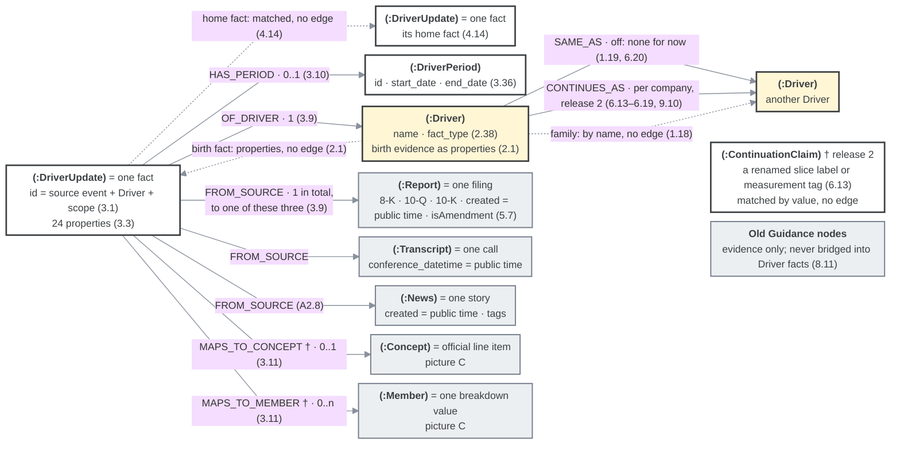
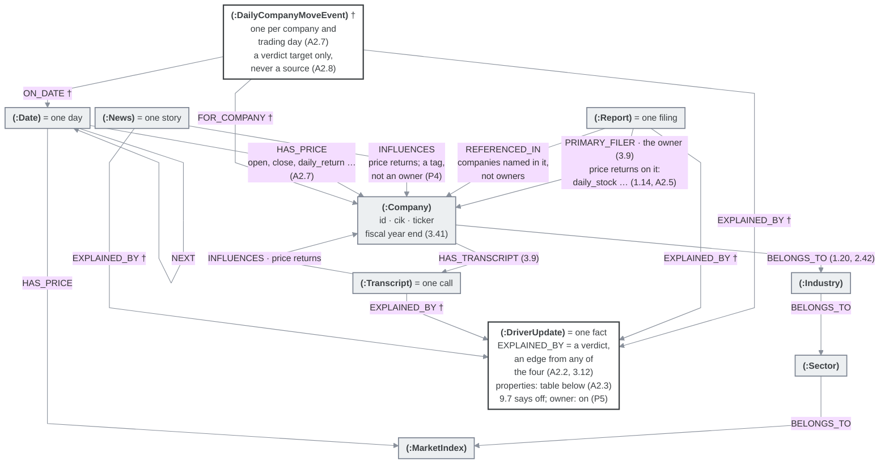
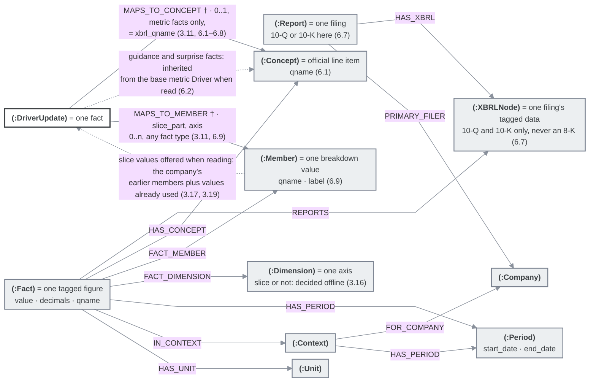

# Driver rules, categorized

Everything in `DRIVER_RULES_Simplified.md` (same folder), sorted into categories. Nothing is reworded: every original line appears here exactly once, and rule numbers are unchanged (3.2 here is 3.2 there). The only new lines are headings, this introduction, the study order and index, table headers where a table was split (the Word list and the Parking list), fold markers around switched-off features, and a few short notes and pointers. The original's summaries, navigation and layout are kept in the Overview at the end.

**Study order:** S1 (read briefly first) → Driver 1 → 2a → 2b → 2c → 3 → DriverUpdate U1a → U1b → U1c → U1d → U2a → U2b → U2c → U3a → U3b → System S2 → S3 → S4 → S5.

**Index:** [Driver](#driver): [1](#1--driver-record--relationships) · [2a](#2a--fact-type) · [2b](#2b--name) · [2c](#2c--which-name--family) · [3](#3--creating-a-driver) — [DriverUpdate](#driverupdate): [U1a](#u1a--record--evidence) · [U1b](#u1b--period) · [U1c](#u1c--slices--measurement-tags) · [U1d](#u1d--states--amounts) · [U2a](#u2a--saving) · [U2b](#u2b--links-to-filing-data) · [U2c](#u2c--reading--comparing) · [U3a](#u3a--forecasts) · [U3b](#u3b--surprises) — [System](#system): [S1](#s1--ground-rules-read-first) · [S2](#s2--purpose-sources--companies) · [S3](#s3--processing-timing--retries) · [S4](#s4--ai-use--testing) · [S5](#s5--price-move-explanations-active-in-release-1) — [Overview](#overview)

**Next steps:** study one home at a time (study order above) → one pass over the whole design → build.

**Overlaps to review** (both kept for now): 1.7 / 7.7 · 2.19 / 4.2 · 2.2 / 2.38 · 2.34 / 6.11 · 3.50 / 7.8 · 1.15 / 6.21 · 3.35 / 7.2 · 1.14 / 7.6.

## Driver

### 1 · Driver record & relationships

- 1.1 The same name is reused for the same cause across companies and over time. *Why:* then scattered mentions line up into one clean history per cause, and that history is what gets acted on.
- 1.2 A Driver (the name) is separate from its facts. Each fact is added under an existing or new Driver and tagged with its source and event. A Driver can have facts from many events; one event can have facts for many Drivers.

**How the pieces connect, as Neo4j holds them.** Three pictures (each prints on one landscape page) and two tables. `(:Label)` = node · `CAPITALS` = relationship name · solid = stored · dotted = no stored relationship · grey = already in the database · yellow = Driver · white = new · † = the name comes from the older design (`FinalDesign/FINAL_DESIGN.md`) or the driver code, not from this file; where this file is silent the older documents decide (see the top of this file), and the pictures approve the presentation, not those choices · "off" and "release 2" as the rules say · (n.n) = the rule · existing nodes show only the links the design uses.

**Picture A — a fact and its Driver**



**Picture B — companies, prices and verdicts**



**Picture C — where the two filing-data links land (tagged filing data)**



**Stored relationships** (the 24 properties of a fact are the table in 3.3)

| Relationship | From → to | How many | Status | Rules |
|---|---|---|---|---|
| `OF_DRIVER` | (:DriverUpdate) → (:Driver) | exactly 1 | new | 3.9 |
| `FROM_SOURCE` | (:DriverUpdate) → one of (:Report), (:Transcript), (:News) | exactly 1 in total; `source_type` must match the node's kind | new | 3.9, 3.3, A2.8 |
| `HAS_PERIOD` | (:DriverUpdate) → (:DriverPeriod) | 0 or 1; the same period id also sits in `fact_scope` | new | 3.10, 3.36, 3.45, 3.46 |
| `MAPS_TO_MEMBER` (slice_part, axis) | (:DriverUpdate) → (:Member) | 0 to many, any fact type | new | 3.11, 6.9, 6.10 |
| `MAPS_TO_CONCEPT` † | (:DriverUpdate) → (:Concept) | 0 or 1, metric facts only, = `xbrl_qname` | new, not built yet | 3.11, 6.1–6.8 |
| `SAME_AS` | (:Driver) → (:Driver) | none for now | off | 1.19, 6.20, 9.9 |
| `CONTINUES_AS` (company_cik, source_event_id, evidence_quote, declared_at, created) | (:Driver) → (:Driver), old → new | at most 1 active per old label, per company | release 2 | 6.13–6.19, 9.10 |
| `(:ContinuationClaim)` † (kind, old, new …), a node | a renamed slice label or measurement tag | one per declared rename | release 2 | 6.13 |
| `EXPLAINED_BY` † (producer, stock_impact, weightage, confidence, mode) | (:Report), (:Transcript), (:News) or (:DailyCompanyMoveEvent) → (:DriverUpdate) | 1 fact per key: target + Driver + scope + producer; 0 to many verdicts per fact; several moves may share one fact (P3) | planned, not built yet · 9.7 says off; owner decision 2026-09-29: on in release 1 (P5, P7) | 3.12, A2.1–A2.6 |
| `FOR_COMPANY` † · `ON_DATE` † | (:DailyCompanyMoveEvent) → (:Company) · (:Date) | 1 each | new | A2.7, A2.8 |
| `PRIMARY_FILER` | (:Report) → (:Company) | exactly 1 owner; the price returns after the filing sit on it (daily_stock, session_stock …) | exists | 3.9, 1.14, A2.5 |
| `REFERENCED_IN` | (:Report) → (:Company) | other companies the filing names, not owners; same return fields | exists | 3.9 |
| `HAS_TRANSCRIPT` | (:Company) → (:Transcript) |  | exists | 3.9 |
| `INFLUENCES` | (:Transcript), (:News) → (:Company); all three sources → (:Industry), (:Sector), (:MarketIndex) | price returns (daily_stock …); for news the company link is a tag, not an owner (P4) | exists | 1.14, A2.5, P4 |
| `BELONGS_TO` | (:Company) → (:Industry) → (:Sector) → (:MarketIndex) |  | exists | 1.20, 2.42 |
| `HAS_PRICE` (open, close, daily_return …) | (:Date) → (:Company), (:MarketIndex) | one per trading day; (:Date) → `NEXT` → (:Date) | exists | A2.7 |
| `HAS_XBRL` · `REPORTS` · `HAS_CONCEPT` · `FACT_MEMBER` · `FACT_DIMENSION` · `HAS_PERIOD` · `IN_CONTEXT` · `HAS_UNIT` · `FOR_COMPANY` | the tagged-data structure in picture C |  | exists | 6.7, 6.9, 3.16 |

**No stored relationship**

| Relation | Between | How | Rules |
|---|---|---|---|
| family | (:Driver) ⇢ (:Driver) | read from the name | 1.18, 2.26 |
| birth fact | (:Driver) ⇢ its first (:DriverUpdate) | id, quote and needed context stored as properties on the Driver | 2.1, 2.35 |
| home fact | a surprise fact ⇢ its metric or guidance fact, same event | matched by family, period, slice, measurement and value | 4.14 |
| inherited line item | a guidance or surprise fact ⇢ its base metric's (:Concept) | worked out when read | 6.2 |
| slice values offered | the company's earlier (:Member)s plus values already used ⇢ the reader's list | cut at public time | 3.17, 3.19 |
| 8-K pairing | an earnings 8-K ⇢ its 10-Q or 10-K | routing only | 3.44 |
| read-time grouping | two labels with the same axis and member, all their linked facts agreeing ⇢ one display group | within one company and slice part | 7.9 |
| never | fact → company directly · action fact → line item · old Guidance data → Driver facts · a day's move as a source |  | 3.9, 6.2, 8.11, A2.8 |
`SAME_AS` = same meaning (reversible; none created for now, 6.20) · `CONTINUES_AS` = a company's declared rename (dated; from release 2) · Family: read from the name (`revenue_guidance` belongs to `revenue`), not stored.

- 1.19 Synonym link = same meaning, reversible; none is created for now (6.20). Family = related flavors, read from the name (1.18). Never use one in place of the other; passing the family check (2.26) never creates or implies a synonym link. In a synonym group, one name is the current representative (the "head"): the earliest, then alphabetical order. Example chain: `net_sales_guidance` → (same family, by name) → `net_sales` → synonym → `revenue`. A missing synonym link costs a missed comparison, never a wrong merged number.

- 2.1 A Driver = name + permanent `fact_type` + its defining evidence, frozen when the Driver is saved: the ID of its birth fact (the fact it was saved with), that fact's exact quote, and only the source context needed to understand it (e.g. the table heading, or the question an answer replies to); never an AI-written summary. The frozen evidence is kept on the Driver itself and never changes, even if the birth fact is re-written later (5.5); nothing depends on finding the quote in the source again. Links are separate, reversible records; the family is read from the name (1.18). Think of an index card: one card per meaning, and each fact is an entry on that card. Every identity check compares against the frozen evidence. *Why:* otherwise a Driver's meaning could drift, one small approval at a time.
- 2.2 **Drivers have no status.** Once saved, a Driver's record, including its frozen evidence (2.1), never changes.

- 2.38 The fact type is set once, at creation. A Driver without a type can't accept facts. A Driver that has facts is never re-typed. No tool may rename, delete, re-type, re-key or orphan a Driver that has facts.

- 5.6 A model may propose synonym links (none is created for now, 6.20) and combinations, but only a reversible link from an approved record is ever applied. A model never deletes, re-keys or moves facts, or skips approval.

<details>
<summary>Folded: Declared renames (&ldquo;continues as&rdquo;), from release 2</summary>

- 6.13 When a company explicitly states that an old label continues as a new one with the same composition and method, a dated, one-way "continues as" link (old → new) is recorded for that company. It can join two Drivers, two slice labels or two measurement tags. *Why:* declared renames are the only way to join old and new labels, including for the ~57% of facts with no XBRL member link, while identity stays split.
- 6.14 Wording like "recast", "recomposed" or "reclassified" refuses it. It needs independent confirmation of the explicit statement, the unchanged composition and both exact ends; otherwise it is refused.
- 6.15 The link is read-only and reversible, and never spreads to a Driver's family (1.18). Reads use it only if it was public before the as-of date, checked at each hop. A switched-off link is ignored in every view, including views of the past, however late the mistake was found. *Why:* ignoring a link can only split a history, which is safe.
- 6.16 Safety: at most one active link from the same old label (a second is refused); two old labels into one new label switch both off; a loop is refused.
- 6.17 A rename proposal never counts as a fact, and repeating the same proposal never creates a second link. A refused proposal never invalidates the other facts from the same source.

- 6.19 If a rename link's two ends have XBRL data, a mechanical check across the change switches the link off automatically when the official line item splits or the direction reverses.

</details>

- 9.6 **No financial-classification field** on Drivers for now; facts carry exact data instead (company-specific XBRL links, money units). Revisit only if a named user and a testable definition exist.

- 9.9 **No instant linking.** A newly created Driver is never linked on the spot as a synonym of an existing one. If this is ever switched on, it needs strong independent confirmation and its own safety design.
- 9.10 **No company renames in release 1; on in release 2.** Declared renames (6.13–6.19) and the reconciled view (7.10) are switched on in release 2. Release 1 never changes a stored label (3.22) and keeps every source document, so release 2 can re-read past filings for rename statements (8.16) and add the links without changing any stored fact.

- 10.2 **Fixing a Driver that was mis-named or mis-typed after it already has facts.** Renaming or re-typing such a Driver is forbidden (2.38), and no approved fix exists; it was left for the design of live Driver creation. *Affects:* live Driver creation. *Decide when:* you design live creation.

**Words used here** (from the original Word list)

| Word | Meaning |
|---|---|
| **Driver** | One reusable cause or standing thing that can matter to a company or market. Stored as a name, a permanent fact type and its frozen defining evidence (2.1); it has no status. |
| **Synonym link** (`SAME_AS`) | A reversible link saying two Driver names mean the same thing; none is created for now (6.20). |
| **Birth fact** | The fact a Driver was saved with. Its ID, its exact quote and the context needed to read it are frozen on the Driver and set what it means (2.1). |
| **Link** | A connection between two Drivers (a synonym link, none created for now, or a company rename link from release 2), or from a fact to its official filing line item. Links are never deleted; after saving, only release 2's rename checks switch one off (6.18). |

### 2 · Naming rules & fact types

#### 2a · Fact type

| Type | Means | Examples from the sources |
|---|---|---|
| `metric` | A standing level or condition you can read again later: a number, or a state like sentiment or a policy in force | `revenue`, `oil_price_per_barrel`, `litigation` |
| `guidance` | The company's own forecast, target or outlook | `revenue_guidance`, `bookings_guidance` |
| `surprise` | A company result compared with the consensus or the company's own earlier forecast; or a company forecast compared with the consensus | `earnings_per_share_surprise` |
| `action_event` | A one-time happening: a decision, transaction, incident, approval or one-off charge | `asset_impairment`, `buyback`, `dividend` |

- 1.5 **The persistence test and the locked definitions.** The persistence test decides metric versus action: between two events, is there a standing level you could read again? Yes → `metric`; no → `action_event`. A `_guidance` or `_surprise` name overrides it. The plain version of the definitions is the table above and 1.6–1.8; the exact locked wording is just below (1.9; `fact_scope` is the fact's scope, 3.2).

<details><summary>The exact locked wording (the meaning authority)</summary>

> **metric** = any standing variable readable again over time (number/cost/price/rate/count/ratio OR a qualitative condition: weather, sentiment, policy-in-force, labor, brand) — NOT only a number · **guidance** = the company's own forward outlook/target/forecast · **surprise** = a company value — DELIVERED (an actual) OR PROMISED (a company guide) — vs a CROSS-PARTY EXPECTATION (analyst consensus/Street, or for an actual the company's own prior guide), NOT vs a prior-period actual (that's a metric change) and NOT a new-guide-vs-own-prior-guide revision (that's a guidance movement); the 3 types (`actual_vs_consensus` / `actual_vs_guidance` / `guidance_vs_consensus`) live in the `surprise=` fact_scope slot (OD-21) · **action_event** = a discrete thing that happened (decision, transaction, incident, approval, one-off charge).

> Persistence test: between two events, is there a standing level/severity you could re-read? Yes → metric · No → action_event. A `_surprise`/`_guidance` framing OVERRIDES. Outlook verbs (expect/anticipate/target/plan to) → guidance, never a metric state. Dual framing allowed (`dividend` = action_event vs `dividend_per_share` = metric). Bare-root defaults: litigation/convertible_notes/dividend_policy/restructuring_costs → metric; corporate_restructuring/asset_impairment → action_event.

</details>

- 1.6 In plain words: forecast words ("expect", "anticipate", "target", "plan to") make a fact guidance, never a metric state.
- 1.7 Both framings of one topic can exist as different Drivers: `dividend` (action_event) and `dividend_per_share` (metric).
- 1.8 Fixed defaults for bare names: `litigation`, `convertible_notes`, `dividend_policy`, `restructuring_costs` → metric; `corporate_restructuring`, `asset_impairment` → action_event.
- 1.9 The quoted text is the meaning authority. A restatement (like the plain version above) may change only labels and typography, never meaning, and adds no clause or example. *Why:* an added clause was tested and made results worse.
- 1.10 *Why these four:* they were checked against all 1,282 names from the catalog work, and none fit no type.

- 2.19 A final `_guidance` or `_surprise` stays in the name and fixes the permanent fact type. One surprise Driver holds all three kinds of surprise comparison (4.2). Guidance and surprise Drivers belong to their base metric's family by name (1.18), never by a synonym link. Only a final suffix counts, and it is stripped only once. *Why:* a forecast or a surprise is a genuinely different fact, so it gets its own Driver, in the base's family rather than merged.

- 2.22 Strip exactly one final suffix (`bookings_guidance` → `bookings`). A stacked suffix (`revenue_guidance_surprise`) is invalid. A suffix in the middle (`fda_guidance_issuance`) doesn't count.
- 2.23 Admit the name only if the rest is a standing metric or condition whose level, state or severity can be read again over time, **and** the source is forecasting it (`_guidance`) or comparing it with expectations (`_surprise`). Any doubt → don't admit. This admits `bookings_guidance` and rejects names like `fda_guidance` or `buyback_guidance`, unless the rest truly is the guided metric.
- 2.24 If it's not admitted, rename it only to a specific, source-grounded name without the suffix (never a broad bucket like `regulatory_guidance_update`), through the normal duplicate checks. If no safe rename exists, hold it.
- 2.25 An admission decision, once made, is reused; a later refresh never re-decides it.

- 2.27 Fixed rules come first and can't be overruled: the suffix rules (2.22–2.24) and the fixed defaults in 1.8.
- 2.28 A bare name judged to be `action_event` is typed action, the safe direction.
- 2.29 A bare name judged to be guidance or surprise is a naming mistake, never a type. It is renamed with the suffix (2.22–2.24), or the item is skipped.
- 2.30 **A bare name judged to be a metric is typed metric only if the evidence shows the name itself is a standing level, value, condition or severity that can be read again over time, and not mainly a one-time action, decision, event or plan, with the exact evidence phrase quoted.**
  - Otherwise it is typed `action_event` with a visible, counted warning; the warning never blocks and never queues.
  - In live use, thin or unclear evidence is never defaulted to action: the item is skipped, unless a rule names an exact trigger that could change the result (8.15).
  - *Why the burden is on metric:* a false metric type is the error that spreads and merges permanently; a false action type fails closed and corrupts nothing.
- 2.31 Examples: `bookings` → metric if a standing-measure phrase is quoted · `buyback` → action (the metric form is a more specific name, like `buyback_authorization_remaining`) · `dividend` → action (metric form: `dividend_per_share`) · `restructuring` → action unless the evidence proves a standing cost or charge metric.

- 7.7 A standing per-unit policy level (e.g. a dividend per share) is a metric; a one-time decision to start, change or suspend the policy is an action (like 1.7).

**Words used here** (from the original Word list)

| Word | Meaning |
|---|---|
| **Fact type** | One of four permanent types: `metric`, `guidance`, `surprise`, `action_event` (§1). |
| **Bare name** | A Driver name with no final `_guidance` or `_surprise`. |

#### 2b · Name

- 2.3 The name holds the cause only; a stated per-unit denominator, a benchmark and a final family suffix may join it (2.15). State, direction, size, time, company, unit and quote live elsewhere. *Why:* a cause-only name is what lets the same cause recur and be tracked; anything extra breaks reuse.

- 2.5 The vocabulary is open and comes from the sources. *Why:* a closed vocabulary was tested and rejected; it turned away about 82% of useful names.
- 2.6 Use all the specificity the evidence supports. Never invent a broader class just to force reuse. *Why:* an earlier version coined generic names, collapsed three different demand stories into one, and failed a fresh test.
- 2.7 Format: lowercase plain letters (a–z), digits and underscores; starts with a letter; at least 2 characters; no trailing or doubled underscore. *Why:* one fixed form means the same cause always gives exactly the same text, so names group and compare reliably.
- 2.8 Word order: thing or actor (a commodity, a customer group, a policy body like the Fed or OPEC), then detail, then metric. Use singular count nouns, except (a) a standard plural term the concept is normally reported under (`earnings`, `bookings`, `sales`, `savings`, `futures`, `receivables`) and (b) a plural whose singular means something else (`product_returns`). The examples are not a list; this two-part test decides. A singular/plural pair naming the same concept is one Driver; if the meaning may differ (`booking` vs `bookings`), keep them separate. Never change a locked phrase (2.10). A stated exclusion or inclusion the name keeps (2.14, 2.17) is written `excluding_X` or `including_X`, right after what X is excluded from or included in: the metric, before any `per_X` (`cost_excluding_fuel_per_mile`); or the denominator, after it (`revenue_per_unit_excluding_self_installation`).
- 2.9 Use the familiar form only when the source doesn't state a meaningful sibling or benchmark. A stated specific instrument wins over the familiar broad name. *Why:* a name everyone already uses gets the most reuse.
- 2.10 Keep standard financial phrases whole (e.g. `ebitda`, `fcf`, `fed_rate`, `cogs`, `rpo`, `gross_margin`, `free_cash_flow`, `same_store_sales`); split up, they become names nobody reuses. A loss, deficit or negative margin is a negative value of the signed metric (`net_income`, `operating_margin`, `earnings_per_share`…), never a separate "loss" Driver. In general, name the signed measure, never one sign of it: an income-tax *benefit* is a negative value of the income-tax expense Driver (3.34).
- 2.11 One name carries one cause. Split independent causes. Keep names short and noun-like.
- 2.12 The company's own measured segment, product, geography, customer group, sales channel or owned stake goes in the slice, not the name. *Why:* facts are already grouped by slice and period when read; a company part in the name would fragment the history.
- 2.13 **The role test.** First ignore generic direction and effect words. Then sort what's left:
  - the company's own measured part → slice;
  - an outside actor, object, platform, policy, event or product that causes the outcome → stays in the name;
  - an unclear role, or a vague leftover → also stays in the name.

  A customer is a slice only when it is the company's own customer population. There is no vendor slice. *Why:* treating an unclear outside cause as a slice can merge two different causes; keeping it in the name may over-split and miss valid groupings.
- 2.14 **Portions.** Population words like `current`, `funded` or `fee_earning` stay in the name and make a different Driver from the bare one.
  - Only a fact about the true whole company has no slice.
  - Network-wide, systemwide, GMV (gross merchandise value) and other curated subsets are *not* the whole company, so they keep their qualifying word in the Driver name.
  - Leftovers the source states ("Other", "Corporate") may be company-specific slices.
  - Accounting eliminations and consolidation artifacts (bookkeeping lines that exist only to add the parts up to the company total) are neither names nor slices: drop and log the artifact and keep the real metric fact.
  - If a fact only *mentions* such an artifact as the reason for a change, it is written on the real metric it affects; if the fact is *about* the artifact itself, it is held and logged. (Eliminations as slices: 3.21.)
  - *Why:* read as the whole company, "system-wide" figures would put a different population into the company's own series.
- 2.15 Only these may appear in a name: the cause, a stated per-unit denominator ("per X"), a benchmark (e.g. Brent in `brent_oil_price`), and a final family suffix (`_guidance`, `_surprise`). *Why:* a denominator or benchmark changes the actual number, so leaving it out would merge different numbers (`oil_price_per_barrel` vs `oil_price_per_tonne`).
- 2.16 **Per-unit names ("per X"):**

| Situation | Rule |
|---|---|
| The source states a business or physical "per X" | Keep it in the name (`oil_price_per_barrel`); never invent one |
| Two names with different denominators | Different Drivers, never synonyms |
| The value's unit | The plain unit, without the "per" part (e.g. `usd`, with "per barrel" in the name) |
| An acronym whose expansion is certain | Spell it out: `EPS` → `earnings_per_share`, `DPS` → `dividend_per_share` (examples, not a list) |
| The expansion is uncertain | Skip the fact; never guess or extend by analogy |
| The name and the stated denominator disagree | Hold the fact |
| The quote | Keeps the acronym as written |
| Scope | Per-unit names only; familiar names (2.9) and standard phrases (2.10) are untouched |

- 2.17 Measurement versions (adjusted, diluted, constant currency…) go in measurement tags, never the name. A missing tag never means GAAP. A measurement tag re-expresses the *same* quantity through a different lens; a word that changes *which portion* is counted belongs in the name instead (2.14). *Why:* one base metric can then carry its GAAP and adjusted readings as separate, comparable facts.
- 2.18 **Never in a name:**
  - state words, direction, motion or change nouns;
  - the reporting company, or any company or person mentioned only in passing (an analyst, executive, law firm or counterparty);
  - period words; numbers, sizes or bare units;
  - source-type labels, vendor metadata, XBRL prefixes;
  - metaphor, sentiment or effect words; bare category words; vague descriptors; glue words.

  **Exceptions:** an outside company, platform, institution or person whose own action or state *is* the cause (`fed_rate`, `aws_outage`, `tiktok_ban`); stable nouns and metric phrases ending in -ing or -ed (`pricing`, `bookings`, `operating_margin`); an effect word only inside a specific, reusable market force (`glp1_pressure`; bare "pressure" stays banned).

- 2.21 Naming rules change only through a general principle, never by adding a sector example as policy. *Why:* examples overfit; named cases pass while unnamed ones break on data never seen.
- ⚠ **A lawful-looking name can point at the wrong thing:** `restaurant_closures` (the cause) instead of `restaurant_closure_impairment` (the charge the company actually recorded).

**Words used here** (from the original Word list)

| Word | Meaning |
|---|---|
| **Benchmark** | The specific reference a price or rate is quoted on, e.g. Brent or WTI for oil. A stated benchmark stays in the Driver name (2.9, 2.15). |

#### 2c · Which name & family

- 1.18 Different flavors of one topic are separate Drivers in one family.
  - The family is read from the name: remove exactly one final `_guidance` or `_surprise` (2.22) to get the base name (`revenue_guidance` → `revenue`). Nothing is stored.
  - A guidance or surprise Driver may exist before, or without, a metric Driver of that name; nothing waits. The metric Driver is born with its own first metric fact (2.35).
  - Action Drivers have no family. A family comes only from a final suffix, never guessed from name prefixes.
  - *Why separate:* a result and a forecast are different signals that can move the stock opposite ways on the same day ("beat this quarter, cut next year's guidance" → down); merged, you'd lose which one moved it.
  - *Why a family:* to ask "did revenue beat its own forecast?" *Why by name:* the name already says which family a Driver belongs to, so nothing needs to be stored.

- 2.4 One stored name has one meaning. Spelling, word-order, acronym and plural variants reuse the standard name. Reusing a name whose words are only reordered needs the independent check (8.2) and exactly the same words (none added, dropped, shortened or swapped); no alias is kept for the old order. No alias lists. A true duplicate found later may get a reversible synonym link. *Why:* an alias list can't hold each variant's own evidence, and duplicate names split the history.

- 2.26 **The family check (a gate).** Once, when a new Driver's name is `X`, `X_guidance` or `X_surprise` and another member of that family already exists as a Driver (whatever its source's date, 1.14; a catalog name without facts doesn't count, 2.36):
  - Before saving, the independent identity check (2.40) compares the newcomer's evidence with each existing member's, asking whether they concern the same underlying measure (each keeps its own type).
  - Same measure as every existing member → the newcomer keeps the name and joins the family.
  - Otherwise (a different measure, a base that isn't a metric (2.32), or unsure) → the newcomer takes a more specific name once, or is skipped (2.47). Existing Drivers never change.
  - Nothing is saved without passing this check. Members saved at the same moment are checked against each other; by save order, the one saved second is the newcomer.
  - There are no empty Drivers. A base with no metric fact simply doesn't exist yet.

- 2.32 A family's base must be a metric. A bare Driver `X` joins a family only if its own birth fact proves it is a metric (2.30, or a fixed default in 1.8) and the family check (2.26) passes. Admitting `X_guidance` or `X_surprise` (2.23) does not prove `X`'s type on its behalf. So `buyback_guidance` can never share a family with an action named `buyback`.
- ⚠ **A wrong `action_event` type can block a real metric's name and family: that metric's facts must take a more specific name (2.47), and there is no approved fix yet (10.2).** Accepted as better than a false metric. When the type is set directly, with no metric check, a wrong action type isn't counted by the warning; its symptom is facts on that name being renamed or skipped.

- 2.40 **The identity test:** same object, same business scope, same mechanism, decided by meaning from the evidence.

  The approved identity checklist applies this test to every new "same Driver" decision (reusing a Driver or linking to one) as five checks, each needing evidence from both sides:
  1. the same exact object, not a broader or narrower class;
  2. the same business population and ownership scope;
  3. the same causal mechanism and position;
  4. no equally plausible competing Driver;
  5. the existing Driver's frozen evidence (2.1) describes one coherent mechanism.

  A detail that only one side mentions is not a conflict, but it is not proof of a match either: each check above still needs its evidence.

  The identity check runs on every new fact, not only when a Driver is created. The family check (2.26), which runs once when a family member is admitted, applies these checks to the underlying measure (what is being measured), not to the flavor, since a forecast and a result are different kinds of fact by design.
- 2.41 Counts never decide identity. Company count, industry count, mention count, exact spelling or popularity may never create, merge, rank, confirm or pick a Driver. There is no "broad" label and no company-count threshold.
- 2.42 Drivers are company-neutral. One is reused across companies only when identity proves the same cause. A cross-company calculation finds its companies from the facts when it runs; fewer than two means no comparison.
- 2.43 Matching searches the whole current catalog, whatever the source's date (1.14), never filtered by company or industry. Industry labels may be shown only as context. When a new metric, guidance or surprise fact matches no existing Driver of its own type, it is also compared with each family that has no Driver of that type yet, read from the names of existing Drivers (1.18). If the family check (2.26) finds it measures the same thing as one such family, it takes that family's base name with its own ending (a metric proposed as `staff_turnover` becomes `employee_churn` when only `employee_churn_guidance` exists). If unsure, or if more than one family fits, it keeps its own name. A surprise always takes the same base name as its home fact in that event (4.14), so the two never split.
- 2.44 The rules state only the general identity test. Real industry-pair examples may be used only as hidden tests, never as rules.
- 2.45 These are always different Drivers: a base metric and its guidance or surprise flavor; names with different final suffixes; different per-unit denominators; different portions (2.14). Names that only share words (`brent_oil_price` vs `oil_price`) are never matched as the same Driver for now; that stays off until a test set shows zero wrong merges. Until then some real matches are missed on purpose, and each miss is counted.
- 2.46 The same decision is reused when the exact same input comes back unchanged.
- 2.47 A fact joins an existing Driver only if it matches that Driver's meaning (2.1). A refusal is final for that decision: no retry, escalation or weaker check can turn it into a merge. The pair is looked at again only after an exact change in its evidence or state that a rule names in advance (8.15). If an exact-name match turns out to mean something different (one name, two meanings), coin a more specific name once; if no safe name exists, skip it.
- ⚠ **Some wrong "same meaning" calls can't be avoided at first sight.** The promise is fewer than 1% wrong at launch, measured with honest upper bounds (8.17); never zero by construction. A mistake that slips past the checks stays (6.20).
- ⚠ **"When unsure, keep separate" creates near-duplicates** (accepted splits, same-moment races, wrongly refused near-matches). No process repairs them, and none is planned (6.20); they stay split, the safe side (1.12).
- ⚠ **A wrong merge of two flavors without a suffix is judged only once, when saved,** and nothing checks it again (6.20); only a suffix makes flavors distinguishable by name (1.18).

**Words used here** (from the original Word list)

| Word | Meaning |
|---|---|
| **Base metric, family** | `revenue` is a base metric; `revenue_guidance` and its `_surprise` twin are its family, read from the name (`revenue_guidance` → `revenue`) and not stored; the base Driver may not exist yet. |
| **Catalog** | The list of known Driver names that new facts are matched against, whatever the source's date (1.14). A first version is built and checked before go-live; after that it grows as new Drivers are created (2.35) and is refreshed after review (1.21). A name on the list is not yet a Driver (2.36). |

### 3 · Creating a Driver

- 2.20 **Create a new Driver only when all of these hold:**
  - no existing Driver has the same meaning;
  - every naming rule passes;
  - its nouns come from the source or the catalog;
  - at least one piece of causal evidence exists;
  - it is reusable: a kind, not one instance (`government_shutdown` is fine even if seen once; `q1_2026_shutdown_effect` is not);
  - its meaning is unambiguous.

  Vague evidence is skipped. *Why:* this keeps junk, one-off and made-up names out.

- 2.33 One real fact in one event is enough; there is no "seen in several events" rule. Boilerplate, bare mentions and non-facts are dropped before storage. Whether a fact is stored never depends on whether it moved the stock.
- 2.34 **Any authorized source may submit raw evidence.**
  - Only the shared core breaks it down, reuses or creates the Driver, builds identity, checks and writes.
  - A source never names or creates a Driver.
  - Drivers may be proposed from prose or readable tables, including qualitative and action causes, but such a proposal may create a Driver only once an independent check for qualitative duplicates exists and passes; until then it is held. Don't weaken this to gain coverage.
  - A source's own grouping of its records carries no identity weight: it never says two records are the same Driver, and the core judges each item on its own.
  - Text is the only route that creates Drivers (6.11).
- 2.35 Every new Driver arrives with its first proven fact ("born complete"). Creating Drivers from names alone is rejected. There are no exceptions: a forecast or surprise fact never serves as a metric Driver's birth fact.
- 2.36 A name on the catalog list is not yet a Driver; the Driver comes into being only with its first written fact (2.35).
- 2.37 A bare-named Driver's first fact must have a readable state, not `unknown`; otherwise it is held until such a fact arrives. A `_guidance` or `_surprise` Driver may start with an `unknown`-state fact. This applies only at creation.

- 2.39 Submissions from different sources about the same event reach the same identity. Exact duplicates (the same name at the same moment) always end up as one Driver. Two near-synonyms created at the same moment are an accepted split (1.12).
- ⚠ **Before text can create any Driver, the new build needs two pieces:** the independent identity check (2.40, 8.2) and the duplicate check for wording-only Drivers (2.34).

## DriverUpdate

### U1 · Describing one fact

#### U1a · Record & evidence

- 1.11 Every fact needs a source quote. A mention without a fact is dropped.

- 1.13 Store only what the source states. Exact rescaling (e.g. "$2.1 billion" to a stored number) is allowed. Logic may add labels, states, IDs or facts, but never an invented number. Vendor-calculated ratios, percentage changes and "common-size" rows (figures restated as a percentage of a total) are never stored as facts (in one vendor's data they were about 62% of rows; that's evidence, not a threshold).

- 1.17 A fact's evidence comes only from its own source.
  - An earlier source never uses a later one as evidence: a later 10-Q may help *find* things during backfill, but the older source must prove its own quote, value, unit, label, period, slice, measurement and meaning; nothing is borrowed from the later source.
  - Every stored number must appear, as printed, in its own quote.
  - An 8-K source event is the whole filing (all sections and exhibits, without duplicates), never just the press-release exhibit.
  - For a table in an 8-K, only the original table counts as evidence; a flattened text, PDF or converted copy doesn't, and unsupported formats fail closed.

- 3.1 A fact's identity = source event + Driver + scope. The extractor (a person or a model) is never part of it. Once written, the identity and the stored scope never change. *Why:* two readers of the same fact then reach the same record.
- 3.2 The scope parts, each only when present: period · slices · measurement tags · surprise comparison kind (surprise facts only; required there) · a tie-breaker used only for true conflicts (5.3). A whole-company fact has no slice; "total" is never stored as a slice. Formatting may be tidied (e.g. lowercase), but different words are never treated as the same value. *Why a surprise kind:* two different expectation gaps on one Driver and period can both be true, so identity must keep them apart.
- 3.3 A new scope part may be added only if it defines identity for that fact type, can't be worked out from the existing parts, and is never compared across fact types.

| Field | Meaning | Values and notes |
|---|---|---|
| **Identity:** which fact is this? | | |
| `id` | The fact's identity (3.1) | Never changes |
| `fact_scope` | The scope part of the identity (3.2) | Never changes |
| **Evidence:** where it came from, and when | | |
| `source_type` | The kind of document the quote truly came from (a press-release quote belongs to the 8-K, never a later 10-Q) | `8k` · `transcript` · `10q` · `10k` · `news`; anything else fails closed |
| `quote` | The exact source words | Always required |
| `date` | The source's full public timestamp | |
| `created` | When the fact was written | Set only at creation |
| **Meaning:** what happened | | |
| `driver_state` | The state (§3 States; forecasts and surprises: §4) | From the fact type's list |
| `company_confirmed` | Did the company or its management say it? | Guidance only; always required (4.9) |
| `value_text` | A forecast stated in words, with no number | Guidance only (4.7) |
| `conditions` | A condition attached to a forecast | Guidance only (4.8) |
| **Amounts and comparisons:** what was stated | | |
| `level_low`, `level_high` | The stated value or range | Shapes in 3.48 |
| `level_unit` | Unit of the value, and of any comparison value | Unit list in 3.28 |
| `change_value`, `change_unit` | A stated change, e.g. "+5%" | Only when stated (3.49) |
| `comparison_low`, `comparison_high` | The value compared against: last year's, the consensus, an earlier forecast | Only when stated |
| `comparison_baseline` | What the comparison is against | `consensus` · `prior_year` · `sequential_period` · `previous_guidance` · none (3.52) |
| **Time:** which period | | |
| `fiscal_year`, `fiscal_quarter` | The company's fiscal framing | |
| `period_scope` | The kind of period | `quarter` · `annual` · `half` · `monthly` · `ytd` · `ttm` · `exact_range` · `short_term` · `medium_term` · `long_term` · `undefined` |
| `time_type` | Does the value cover a span or a single moment? | `duration` · `instant`. Always stated, never defaulted. |
| **Grouping and links** | | |
| `series_unit` | A grouping label that keeps one series together when read (3.35) | Set once, when written |
| `xbrl_qname` | The official XBRL line item this metric matches | Metric only; added later (§6) |

| | metric | guidance | surprise | action_event |
|---|---|---|---|---|
| Identity, state, quote, source, Driver | required | required | required | required |
| Period | when real | required | when real; required for `guidance_vs_consensus` | rare; only when real |
| Value and change | only when stated | only when stated | only when stated | only when stated |
| Comparison values | when stated | the earlier forecast, when stated | the expectation, when stated | when stated |
| Comparison baseline | only `prior_year`, `sequential_period` or none (3.52); expectation baselines forbidden | `consensus` forbidden | required: `consensus` or `previous_guidance` | when stated |
| Surprise kind in scope | forbidden | forbidden | required | forbidden |
| `value_text`, `conditions` | forbidden | allowed (4.7–4.8) | forbidden | forbidden |
| `company_confirmed` | forbidden | required on every stored guidance fact | forbidden | forbidden |
| Direct XBRL line item | allowed | forbidden; inherits from the base | forbidden; inherits from the base | forbidden |

- 3.7 Metric, surprise and action facts are written from the source text alone, never from past facts. Only guidance may look at earlier facts when written, and only at those public before the source's public time (e.g. to copy a withdrawn forecast's series unit, 3.35, or to spread a withdrawal, 4.18). A guidance movement the source doesn't state is still worked out when read, never stored (4.4).

- 3.9 Exactly one link to its Driver, and exactly one link to its source event (a filing, transcript or news story). The company is reached through the source event, not a direct link. A source event must belong to exactly one company, found through ownership, never by counting mentions; otherwise it is held.
- 3.10 One link to its period (3.36), when it has one.

- 3.12 Optional verdict links from a source event or daily move event that the fact helps explain (folded Part A2).

**Words used here** (from the original Word list)

| Word | Meaning |
|---|---|
| **DriverUpdate** (a "fact") | One real, source-backed occurrence of a Driver in one source event, e.g. "revenue rose 5% to $2.1B" in one earnings release. |
| **Source event** | The one whole document a fact comes from: one SEC filing (all its sections and exhibits), one earnings-call transcript, or one news story. Every fact has exactly one. |
| **Quote** | The exact words in the source that state the fact. |

**Parking-list items** (from the original Parking list)

| # | Rules | Issue → why it matters | Resolved | Not resolved | Refs |
|---|---|---|---|---|---|
| P4 | 3.9 | A news story has a company tag, not an owner → read strictly, every news fact (macro ones too) is held | All but 1 of 348,670 stories have exactly one tag (checked 2026-09-29; query: note P4) | Does the tag count as an owner? Decide when news is admitted (9.5) | `driver_reference/core/driver_neo4j_adapter.py:5` "News currently has no proper ownership edge" |

- **P4 query** (Neo4j): `MATCH (n:News) WITH n, COUNT { (n)-[:INFLUENCES]->(:Company) } AS k RETURN k, count(*)` → 1 story with 0 companies; 348,669 with exactly 1.

*To trace these references, see “How to trace a reference” in the Overview.*

#### U1b · Period

- 3.36 A fact's period is the real calendar window the fact is about. It is not the event date, a raw "Q1", a forecast marker or a stand-in for the fact type. One kind of period record serves all four types and stores only its ID and start and end dates; the fiscal framing stays on the fact, because companies describe the same window differently. *Why real windows:* only they compare across companies — a December-year-end Q1 (Jan–Mar) is not a September-year-end Q1 (Oct–Dec).
- 3.37 Guidance always needs its *target period* (the period the forecast is for): a real one, or an explicitly stated vague horizon. Metrics and surprises use a period that is stated, clearly implied or safely worked out. An action gets a period only when a real window is stated; never force one, since that would invent structure. The filing type alone never says whether a figure is quarterly or annual (a 10-K can state a fourth quarter, an 8-K a full year); that comes from the stated wording or the source's own series.
- 3.38 A result surprise uses the reported period. A `guidance_vs_consensus` surprise uses the forecast's target period, even if it has ended. The source event's own details (e.g. the period a filing covers) may supply an implied reported period only when exact, and never for `guidance_vs_consensus`.
- 3.39 Exact year-to-date, trailing-twelve-month, cumulative and stated ranges beat fiscal shorthand: keep the real dates, never squeeze them into a quarter. *Why:* some fiscal years run 52 or 53 weeks, so month-based math lands a few days off.
- 3.40 Four vague horizons for real dateless windows: `short_term`, `medium_term`, `long_term`, `undefined`. A stated date range is stored as `exact_range`. An unresolved period without an explicit horizon fails. Actions never get a vague horizon. `undefined` means a period-like horizon exists but isn't defined ("going forward"); a periodless action (a CEO resigned) gets no period at all. `undefined` is never a quiet fallback.
- 3.41 One shared fiscal-calendar resolver works out every fact's window: exact dates first, then an explicit horizon, then a stated long range, then the fiscal framing (month, half, quarter, year). A missing fiscal-year end fails closed, because a wrong one silently makes wrong windows. Market-wide facts (oil price, the Fed funds rate) use the calendar year, since they have no company fiscal year.
- 3.42 **Missing or messy dates.**
  - A duration needs both end dates. An end-only horizon ("by 2030") is valid; a start-only one is incomplete and held.
  - A missing end date may be filled only from matching evidence: first confirm the company, fiscal year, quarter (or an explicit calendar range) and period kind all match; then check the whole window makes sense; then keep the given date and fill only the missing one. A single matching day is not proof.
  - Anything unproved or conflicting is held, never guessed: conflicting, mixed or out-of-range details, or a stated label that contradicts the window's length.
  - Holding means no stored record until it's resolved; evidence is never deleted.
- 3.43 Dates from the filing itself win over stored or cached calendar windows. Don't assume stored fiscal dates are correct (see the watch-out below).
- 3.44 **Earnings 8-K pairing.** Each earnings 8-K is matched to its 10-Q or 10-K exactly.
  - Before that filing exists, go ahead only when the quarter's identity is certain.
  - Missing or ambiguous → hold.
  - These are the only two ways: never a third, and never pairing by fiscal label, projected date or filing order.
  - Once the 10-Q or 10-K exists, only the exact match counts: a failed match is held and never falls back to the live check.
  - Several 8-Ks may map to one periodic filing and remain separate events.
  - This pairing only routes the source; the fact's own window is worked out as in 3.41.
- 3.45 The same resolved period appears in the scope and in the period link, checked both ways. After writing, the resolved dates are the truth; raw fiscal year and quarter never regroup facts later. Never group by period alone: forecasts, results and surprises share periods and would blend.
- 3.46 The same window always maps to the same single period record. A single day is an `instant`; a duration whose start equals its end is invalid. Dates are write-once: a wrong first date doesn't fix itself, and a mismatch fails.
- 3.47 `time_type` (duration or instant) is always stated from the meaning, never defaulted.
- ⚠ **Stored fiscal dates can be wrong.** Darden FY2026 Q3 was stored as Dec 1–Feb 28; the filing says Nov 24–Feb 22. Such windows came from month-based math made before the filing existed, and other companies haven't been rechecked.

**Words used here** (from the original Word list)

| Word | Meaning |
|---|---|
| **Period** | The calendar window a fact is about, not the day it was said. |
| **Vague horizon** | A named window with no dates: short term, medium term, long term, or undefined. |

#### U1c · Slices & measurement tags

- 3.13 A slice is stored as `kind:value`. The kinds, with their tests:
  - `segment` (the company *operates as* it, e.g. `taco_bell`)
  - `product` (it *sells* it, e.g. `iphone`, `aws`)
  - `geography` (it *operates in* it, e.g. `china`)
  - `customer` (it *sells to* them)
  - `channel` (*how* it sells or runs, e.g. `franchised`)
  - `entity_ownership` (a *stake it owns*; the least clean kind — joint ventures and part-owned companies are the strongest cases; other entity rows are provisional)
  - plus the safe fallback `unknown`.
  - *Why:* the tests work for any metric and match how XBRL breaks data down; a fixed set of kinds keeps slices checkable while values stay open.
- 3.14 A real slice is a business population where "revenue or earnings from ___" makes sense. Accounting labels (fair-value levels, a term loan, stock awards, reconciling items) are not slices. Leftovers the source states ("Other", "Corporate Unallocated") are allowed as company-specific slices, marked as not continuous when read. Pure eliminations, fair-value levels and consolidation artifacts are dropped and logged, never stored as slices; blended leftovers follow 3.21.
- 3.15 A brand is not a kind; the axis it sits on, or its role in the prose, decides (Taco Bell → segment; Kraft → product), because the same word can be a segment at one company and a product at another. A fact may have several slice parts; all are kept, never dropped. Slices apply to all four fact types. A period is never a slice. No slice = the whole company (metric, guidance, surprise) or no applicable part (action).
- 3.16 **Which XBRL breakdown axes count as slices is decided offline, by looking at an axis's *members*, never its name.**
  - *Why:* axis names mislead in about 20% of cases.
  - When facts are processed, an axis is one of three things: a known slice axis (use its kind), a known non-slice axis (ignore that part), or an unknown axis (a provisional slice, never silently dropped).
  - No AI judges a slice's kind at runtime.
  - *Why:* company-made axes are common; silently skipping a real one would merge real businesses, while a provisional slice can only over-split.
- 3.17 The list of a company's slice values offered while reading = every member from all its earlier public 10-Q/10-K filings, plus values already used for that company, cut at the source's public time. Naming a Driver uses no such list. *Why:* a list built from all filings finds discontinued or renamed segments instead of creating duplicates.
- 3.18 For each slice part, in order:
  1. reuse a listed value with the same meaning, taken exactly from the list, never snapped to a near match;
  2. create a new value grounded in the source when the kind is clear from the prose;
  3. use `unknown:<value>` when the kind is unclear, or when the same label exists under several kinds and nothing says which;
  4. leave it out for the true whole company.

  Ambiguous prose must not guess. The AI may pick an existing value or create a new one, but never merges two existing values; only fixed rules delete (from a fixed list) or merge values, and only on an exact match. *Why:* an extra split can miss a grouping; a wrong match can blend different businesses.

- 3.19 A slice from an unknown XBRL axis is stored as an `unknown` value that records the exact axis, so it can be reused later.
- 3.20 Within one company, a breakdown member joins an existing value only when the whole `kind:value` matches exactly after formatting is tidied. Never a fuzzy match, never word or suffix stripping (`EuropeSegment` ≠ `europe`). The same words under different kinds are different values and never join (`geography:international` ≠ `segment:international`). *Why:* this really happens: the same label appears on both the geography and segment axes at some companies (e.g. `international` at 5 companies).
- 3.21 **Eliminations** (both lists below apply only to segment-type breakdowns). A short, hand-checked list of pure eliminations actually seen on segment axes is always excluded; names never seen are not pre-listed.
  - Blended "Corporate/Other/Eliminations" and reconciling leftovers are kept as provisional slices: stored and never deleted, but kept out of cross-company use.
  - Everything else is a normal slice, so a missed elimination errs on the side of an extra split.
  - Every exclusion is logged.
  - Mistakes are fixed only offline, by moving an item from the excluded list to the provisional list; nothing is demoted automatically.
  - *Why a fixed list, not a word pattern:* a pattern caught real businesses about 20% of the time (e.g. `GlobalPestElimination`, a real Ecolab business).
- 3.22 A stored slice value never changes after it is first written. There is no alias layer and no "confident alias" merging. The only grouping of drifting labels happens at read time, within one company, and only when every linked fact for both labels shares the same exact XBRL axis and member. Drift seen only in prose stays split. *Why:* never changing a stored value keeps identity stable, so re-runs land on the same record.
- 3.23 There is no cross-company rule that equates slice values; provisional slices stay out of cross-company analysis. Reads group by the full series (7.1), never by Driver or slice alone. *Why:* grouping by Driver alone would blur, say, Taco Bell, China and the company total into one line.
- ⚠ **The one place a mistake merges instead of splits:** an XBRL axis wrongly marked "not a slice" silently folds real segment data into the whole-company total, with no automatic repair. Only offline review of the logged skips protects it.
- ⚠ **Unreviewed XBRL axes can hold real business data:** for example, 246 real Agilent end-market facts sat on an axis marked "not a slice".

- 3.24 Measurement tags are an open, source-grounded, sorted set inside the scope; not a fixed list and not part of the name. *Why:* one fixed slot would merge GAAP basic with GAAP diluted; keeping the exact words keeps "adjusted EPS" apart from "core EPS".
- 3.25 The exact qualifying words are copied from the source, then tidied (lowercase words joined with `_`) and sorted. One unbroken run of qualifiers is one tag (`adjusted, diluted` → `adjusted_diluted`); split only where other words come between.
- 3.26 **Never drop a qualifier.** Any modifier of a number that isn't fully captured by the name, period, unit, slice or growth basis stays as a tag (e.g. `ttm` when the true rolling window can't be built).
  - When unsure, keep it.
  - Example: "more than $4B" vs "at least $4B" — a lower bound alone (a "floor", 3.48) can't tell them apart, so the wording stays as a tag.
  - An empty set is valid and never means GAAP.
  - What counts as "already captured" can be subtle: Darden's "before income tax" heading on a direct impairment charge adds nothing, because the charge itself is the direct amount, so the tag is allowed but unnecessary (a settled review; see the watch-out below).
- 3.27 Tag synonyms are never merged when writing. Views that treat equivalent labels alike exist only at read time and never change identity.
- ⚠ **Qualifiers are subtle.** Darden's $24.7M impairment was judged not to need its "before income tax" column heading, because the charge itself is the direct amount; the settled review says the extra tag is allowed but unnecessary (3.26). That judgment doesn't allow dropping meaningful qualifiers in general.
- ⚠ **Same fact, different records.** Two correct readings of one fact (e.g. with or without an optional tag) create two different identities. Consistent reuse of the same Driver and tags is unproved.
- ⚠ **Wording drift in measurement tags can split one series:** a company restating "adjusted" as "non-GAAP" may split one series in two. The loss is accepted; only a read-time view can bring them together, and grouping by XBRL member doesn't cover it.

- 9.3 **No cross-company slice comparison.** Company-specific slice values are never compared, equated, merged or ranked across companies; the same words are not proof of the same meaning. Reopen only for a named user with a real need, and a design that keeps precision without aliases, word matching, fuzzy logic or identity changes. If it's ever built, company-specific leftovers ("Other", "Corporate") stay excluded.

**Words used here** (from the original Word list)

| Word | Meaning |
|---|---|
| **Slice** | The part of the company a fact is about: a segment, product, geography, customer group, sales channel or owned stake, e.g. `geography:china`. No slice = the whole company. |
| **Measurement tag** | How a number was measured, e.g. `adjusted`, `diluted`, `constant_currency`. |
| **GAAP, non-GAAP** | GAAP = the official US accounting rules. Non-GAAP = a company's own adjusted figures outside those rules (e.g. "adjusted EPS"). |
| **Axis** (XBRL) | A breakdown dimension in a filing, e.g. "by segment" or "by region". A member is one value on it. |

#### U1d · States & amounts

| Type | Allowed states |
|---|---|
| metric | `increased` · `decreased` · `unchanged` · `mixed` · `reported` · `persists` · `unknown` |
| guidance | `introduced` · `raised` · `lowered` · `reaffirmed` · `withdrawn` · `unknown` |
| surprise | `beat` · `in_line` · `missed` · `unknown` |
| action_event | `at_risk` · `announced` · `occurred` · `continued` · `resolved` · `canceled` · `suspended` · `rumored` · `failed` · `unknown` |

- 3.5 The state lives on the fact (`driver_state`), never in the Driver name. The quote stays the precise truth. Good or bad news never decides a state. A state outside the fact type's list is invalid.
- 3.6 **Metric states** (the first row that matches wins):

| The source… | State |
|---|---|
| states a direction | `increased` / `decreased` |
| shows the same Driver moving differently across parts | `mixed` |
| states it is flat | `unchanged` |
| says it is ongoing, with no direction | `persists` |
| gives a bare value | `reported`; but if it also states the prior value, `increased` / `decreased` |
| none of these | `unknown` |

- *See also:* Guidance and surprise states are in §4: 4.4 and 4.10–4.12.
- 3.8 **Action**, the latest stage of one action:
  - **Final:** `failed` = the action fell through other than by the company withdrawing its own plan (this includes declining an offer it never committed to) · `canceled` = the company's own voluntary withdrawal · `resolved` = a settled two-sided dispute · `occurred` = completed.
  - **Not final:** `rumored` = unconfirmed third-party reports (a denial stays rumored) · `at_risk` = a specific, current threat the source flags, not the company's own plan (generic risk boilerplate is dropped) · `suspended` = paused and resumable (shelved, postponed) · `announced` = the company's stated own action before completion · `continued` = still ongoing.
  - Scrap, abandon or withdraw → `canceled`. A threat stays `at_risk` until it happens, then `failed`.

- 3.28 Units: `usd` (money per unit: prices, per-share and per-barrel amounts) · `m_usd` (money totals, stored in millions: "$1.5 billion" → 1,500) · `percent` (a percentage level, e.g. a 17.6% margin) · `percent_yoy` (growth vs a year earlier) · `percent_sequential` (growth vs the previous comparable period) · `percent_points` · `basis_points` · `count` (e.g. a share count) · `x` (a multiple, e.g. 2.5x) · `unknown`.
- 3.29 **The unit and scale of every number must be backed by evidence.**
  - For text facts, that's the smallest span inside the quote that supports the scale ("billion" for billions; a "$" alone is enough only at a scale of 1).
  - Evidence may be missing only when the scale is 1 and there's no unit or scale marker.
  - For XBRL-backed facts, the filing's own unit and scale data replaces quote evidence.
  - A unit or scale is never worked out from a name, label, concept name or the size of the number.
  - If the marker (e.g. a "$ in millions" table heading) sits outside the quote, the quote is widened to include it, or the fact isn't recorded; nearby text is never searched for it.
  - Numbers stay exact at every step: scaling is exact, nothing is rounded or cut to fit, and a number that can't be kept exactly is held.
  - Two amounts are compared only on the same scale ("1 billion" and "1 million" never match).
- 3.30 **The value and its comparison share one unit (`level_unit`); a change has its own (`change_unit`).**
  - Work them out separately.
  - `level_unit` is required when any value or comparison number exists; `change_unit` when a change exists.
  - `unknown` is allowed when the source doesn't settle it safely.
  - No number → no unit, with one exception: a growth basis the source supports goes in `level_unit` even with no number (3.33).
  - *Why:* a value and its change often have different units; comparisons are almost always in the value's unit; and forcing a unit onto a number-free fact would invent data.
- 3.31 Validity: percent units and `x` need a scale of 1; cents on a company-wide total is invalid; money in a currency other than US dollars is `unknown` and counted (9.1).
- 3.32 Units live on facts, not Drivers; per-unit names: 2.16. *Why:* one Driver can have facts in different units over time.
- 3.33 **Growth basis** (which unit a growth number gets). Use `percent_yoy` or `percent_sequential` only when the quote establishes the comparison basis (widened as in 3.29); otherwise use `unknown`. Never a default, never the company's history.

| The source says… | Unit |
|---|---|
| points or basis points (this wins over any "year-over-year" or "sequential" wording) | `percent_points` / `basis_points` |
| growth compared with the same period one year earlier, established by the quote ("FY2027 versus FY2026" qualifies; "FY2027 growth of 5%" alone does not) | `percent_yoy` |
| no comparison basis established by the quote | `unknown` |
| growth against the immediately previous comparable period | `percent_sequential`; valid only for periods shorter than a year (on an annual period, sequential equals year-over-year, so it is always `percent_yoy`) |
| growth over a vague horizon | `unknown` |
| "up or down X%" on a metric that is itself a percentage | `unknown`, unless points, basis points or "to X%" is stated |

- Growth is never plain `percent`.
- A value stated on two bases becomes two facts, one per basis.
- A numberless growth fact may take its unit from the source's framing; that unit goes in `level_unit` (`change_unit` is used only when a change number exists).
- Adjustments like constant currency or organic go in measurement tags and never decide the basis.
- *Why:* stamping a sequential forecast as year-over-year is wrong data and mixes the two in one series.

- 3.34 **Signs: store the signed value.** A net loss is negative, never a positive "loss" amount. A charge or provision is positive; a benefit, credit, release or reversal is negative.

| Source says | Stored as |
|---|---|
| "$1.5–2.0B loss" | range −2000 to −1500 |
| "at least a $1B loss" | a ceiling of −1000 with no lower bound (income is at most −1000) |
| "EPS $(0.10) to $0.05" | −0.10 to 0.05 |
| "impairment charge $2B" | +2000 |
| "provision release $50M" | −50 |
| "loss narrowed" | `increased` |
| an income-tax benefit of −94 against −175 | `increased` (−94 is higher) |

- Bounds follow the sign: because a loss is negative, "a loss of up to 2B" sets a floor at −2B (it can go no lower).
- Ranges may cross zero. A loss with no number has no numeric bounds. A conditional downside stays in words.
- The sign can come from a noun (loss, charge, benefit), a comparison ("no worse than", "narrower", "wider"), accounting notation (brackets or a minus) or context.

- 3.35 **Series unit.** Each fact gets a grouping unit, set once when written:
  - a fact with a value uses its value's unit, with money put on the Driver's one scale within a currency.
  - A fact with only a change (no value) uses the Driver's usual unit only when its own evidence (never the name) proves that unit; otherwise it keeps its own change unit (its own group) or `unknown`.
  - A fact with no number has none, except a withdrawal or reaffirmation, which copies the unit of exactly one clear earlier forecast (otherwise it fails closed).
  - Reads group by exact equality: no unit families, and `unknown` is never absorbed. Facts with an `unknown` series unit stay readable on their own; they are never grouped into a comparable series, not even with each other.
  - The series unit never rewrites the stored values.
- ⚠ **Growth with no stated basis is `unknown` and counted.**

- 3.48 **Number shapes** (a stated zero is a real value, never treated as empty):

| Shape | Means |
|---|---|
| **point** | low and high equal |
| **closed range** | both present, low < high |
| **floor** | low only |
| **ceiling** | high only |
| **numberless** | all empty |

- 3.49 Change and comparison numbers are stored only when the source states them. At most one main comparison per fact; a comparison type may be stored without comparison numbers. Leave the change empty when it could simply be worked out from a closed range; it's worked out when read.
- 3.50 **Value or change?** *(one row is a chosen reading; see the note)*

| The source says… | Stored as |
|---|---|
| a growth percentage on a Driver that is itself a growth rate: same-store sales "rose 3%" | value 3, unit per 3.33 |
| a growth percentage on a Driver with its own level: revenue "up 5%" | change +5, unit per 3.33 |
| a move in basis points or percentage points, with a direction and no "to X%": margin "rose 60 bps" | change +60, `basis_points` (always a change, never the value) |
| the same with "to 17.6%" | value 17.6, `percent` |

**Chosen reading:** the design documents state the basis-point case two ways (as the value when the Driver is itself a rate, or as a change). This rule treats it as a change. If you disagree, this is the one line to revisit.

- *See also:* For guidance amounts (value or revision?): 4.6.
- 3.51 Sign check: with a stored change, `increased`/`raised` need a positive change and `decreased`/`lowered` a negative one. `beat`/`missed` are exempt (good or bad is a meaning judgment).
- 3.52 **Comparison baseline:** `consensus` · `prior_year` · `sequential_period` · `previous_guidance` · none.
  - Store only the source's headline comparison. On a tie, `prior_year` wins over `sequential_period`; the rest stays in the quote.
  - None when the anchor isn't a prior period: against peers, against an anchor year like 2019, or a streak.
  - "Exceeded expectations" on a surprise → `consensus`. On a guidance fact, "exceeded our guidance" → `previous_guidance`, otherwise none.
  - `consensus` = analysts, the Street, the market. `previous_guidance` = clearly the company's own guidance. There is no "internal target" value: the company's own target wording → `previous_guidance`, otherwise none.
  - A beat size that can be worked out is never stored; it's worked out when read as value − comparison, only for point comparisons.

- 9.1 **US dollars only.** Never convert another currency, infer an exchange rate, or treat an unknown or foreign currency as dollars. A text fact in another currency gets the `unknown` unit and is counted; a tagged-filing fact in another currency is skipped and counted. No such fact enters a dollar series. Full currency support later needs its own design, based on an official currency standard, with values kept as stated, currency-safe identities and reads, complete coverage evidence, and no hand-written currency list or conversion rule.
- ⚠ **Other currencies:** the only unit gap found in testing was euros becoming `unknown` (a safe under-merge); non-dollar data is thinly covered.

- 10.4 **Is a dash (—) in a table a zero?** Test runs read a prior-year dash as zero, but no rule decides it. *Affects:* reading table values. *Decide when:* you design the reader.

**Words used here** (from the original Word list)

| Word | Meaning |
|---|---|
| **State** | What the fact says happened, from a fixed list per fact type, e.g. `raised`, `beat`, `occurred` (§3). |
| **Percentage point, basis point** | A percentage point is the plain difference between two percentages (5% → 7% = 2 points). A basis point is 0.01 of a percentage point. |
| **Scale** | The multiplier a number is stated in: "$2.1 billion" is 2.1 at a scale of one billion. |

### U2 · Saving, linking & reading

#### U2a · Saving

*See also: parking item P6 in S3 (simplifying the five item outcomes, 8.14).*

- 3.4 One more flag sits outside the 24: the conflict flag on an extra fact (5.3).
- *See also:* What may change after a fact is saved: 5.1.

- 5.1 **What may change after a fact is saved** (a summary; each row points to its rule):

| Part of the record | After it is saved | Rule |
|---|---|---|
| The fact's identity and scope | Never change | 3.1 |
| A Driver's name and fact type | Never renamed, re-typed or re-keyed once it has facts | 2.38 |
| A stored slice value | Never changes | 3.22 |
| A period's dates | Write-once; a mismatch fails | 3.46 |
| An empty field | May be filled by a compatible piece of the same fact | 5.2, 5.3 |
| A stored value (one of the ten value fields) | Never changes after saving | 5.5 |
| Other fields (e.g. quote, state, date) | The last write wins, with a log; a blank never erases a stored value | 5.5 |
| A re-run of the same input | Changes nothing | 5.4 |
| A newly published amendment | Becomes a new fact at its own public time | 5.7 |
| A later company confirmation of guidance | Becomes a new fact; history is never rewritten | 4.9 |
| A link | Never deleted; from release 2, a wrong rename link is switched off by the mechanical checks | 6.18 |
| A saved fact | Never hidden or deleted; no audit or repair runs after saving | 6.20 |
| A guidance movement worked out when read | Never written back | 4.4 |

- 5.2 Pieces of the same fact (same event, Driver and scope) are combined first, filling blanks only and never overwriting. Pieces that disagree on a value are not combined. If the pieces could be combined in more than one way, the whole group is held; the input order never decides. *Why:* repeats of the same fact (a press release and the filing's management discussion both saying "Q1 +3%") become one fact.
- 5.3 **Two values for the same fact** (same event, Driver and scope). Decide using the database as it stood before the batch, so the input order can never decide the outcome.
  - Compare only the ten value fields: `level_low`, `level_high`, `level_unit`, `change_value`, `change_unit`, `comparison_low`, `comparison_high`, `comparison_baseline`, `value_text` and `conditions`. The quote, state, company confirmation, producer, source type, date and XBRL links are not compared.
  - Two facts are **the same** when all ten match, blanks included; **compatible** when no field filled on both sides disagrees (blanks don't count); **conflicting** when at least one field filled on both sides disagrees.

| Already stored | What arrives | Result |
|---|---|---|
| no existing fact | new facts | store one; several conflicting new facts → keep them all, each with a tie-breaker added to its scope |
| one existing fact | a compatible fact | fill its blanks |
| one existing fact | a conflicting fact | add an extra fact, flagged as a conflict; it stays readable (7.11) |
| several existing facts | an exact match | it merges |
| several existing facts | a fact conflicting with all | add an extra fact |
| several existing facts | a compatible but not exact fact | hold (never guess) |
| one partial existing fact | two new facts competing for it | hold both; a fuller re-run settles it |

- 5.4 A fact is re-written only when a field really changes; re-running the same input changes nothing.

- 5.5 A stored value is never corrected in place; a later source adds its own fact (5.3). Other fields: the last write wins, and it's logged. A blank never erases a stored value: a re-read with less detail is taken to have missed it; nothing clears a field. Late history is never re-keyed; two identical facts from a race read as one. Within one group, at most one fact has no tie-breaker, and every pair of facts must disagree on at least one filled value.

- 5.7 An amendment is a new fact at its own public time; the "latest wins" read rule (7.5) makes it win naturally. An amended filing is a new report, never a silent rewrite.
- *See also:* A correction with no business-change wording never reads as a raise or a cut: 4.5.
- 5.8 A fact is saved only if everything its decision relied on still holds at that moment: the check and the write happen together, protected against conflicting changes (plain code). If a relevant change invalidates the approved save, nothing is saved and the event is held (8.14). A test run uses the same checks.

**Words used here** (from the original Word list)

| Word | Meaning |
|---|---|
| **Producer** | Whatever produces a fact or a verdict (e.g. the reader, or an approved source). |

**Parking-list items** (from the original Parking list)

| # | Rules | Issue → why it matters | Resolved | Not resolved | Refs |
|---|---|---|---|---|---|
| P1 | 3.4, 5.3 | They say a conflict flag is stored → no such field exists, so a builder could add one | Only the tie-breaker in the extra fact's ID (3.2) marks a conflict; design and code agree | New wording (draft: note P1) | `archive/66_IssuesToBeHandled.md:343` "zero new stored artifacts" · `driver_reference/core/driver_writer.py:365` "zero new stored artifacts" |
| P2 | 5.3 | Names a fact's producer, but none of the 24 fields (§3) stores it → which channel and reader version made a fact is lost for good | Verdicts store theirs (A2.2); never part of a fact's identity; not a list (note P2) | Store it? In what form? (options: note P2) | `FinalDesign/FINAL_DESIGN.md:146` "Producer/model identity is never in the fact key" · `FinalDesign/ChannelContract.md:634` "Two channels may hit the SAME source event" · `driver_reference/core/driver_writer.py:40` "assert len(STORED_FACT_FIELDS) == 24" |

- **P1 draft:** 3.4 → "No other field is stored on a fact. A conflict (5.3) adds no field: the tie-breaker in the extra fact's ID marks it." · 5.3 table row → "add an extra fact, marked as a conflict (3.4); it stays readable (7.11)".
- **P1 audit note (2026-09-29):** in `DRIVER_RULES_Categorized.md`, 3.4's "the 24" now sits in U2a, far from the 24-field table in U1a; when rewording 3.4, point to that table.
- **P2 options (2026-09-29):** store nothing (then drop "producer" from 5.3) · one name, set once at first save, never changed · one name, last write wins (hides who saved first; older names only in run logs) · a list of every writer (rejected by you). One name can't show two channels that saved the same fact.

*To trace these references, see “How to trace a reference” in the Overview.*

#### U2b · Links to filing data

- 3.11 Optional links to XBRL data (§6): at most one official line item (metric facts only; the same one named in `xbrl_qname`), and any number of breakdown members (any fact type), each saying which slice part it supports.

- 6.1 Attach the exact company-reported line item, or attach nothing. A wrong link does silent damage that nothing undoes after saving (6.18); a missing link fills itself in on a later run at no risk.
- 6.2 Only a base metric gets a direct link. Guidance and surprise facts inherit the line-item link of the metric Driver named by their base (1.18), only when that Driver has facts public before the read's date; actions never link; a non-GAAP measurement blocks inheritance. *Why:* a forecast or surprise has no XBRL line of its own; the line lives on the metric. Otherwise they get no link for now; a direct guidance or surprise link is never written to fill the gap.
- 6.3 A fact's measurement tags count as GAAP-compatible only when they are empty or exactly one of `gaap`, `basic`, `diluted`, `reported`, `as_reported`. Anything else, including any combination, → no link.
- 6.4 Never linked, as a principle and not a word list: events and macro causes (resignation, buyback, oil price, interest rates, tariffs, weather…); ratios, derived and growth figures (margins, growth, return on invested capital, EBITDA, free cash flow, per-square-foot, mix…); non-GAAP or adjusted figures. Tax rates are real GAAP line items and may link.
- 6.5 A match must be the same metric: cost of revenue ≠ revenue, a subtotal ≠ its total, basic ≠ diluted. Refuse anything related-but-different: GAAP vs non-GAAP, gross vs net, subtotal vs total, the wrong statement, or a breakdown instead of the consolidated line. When two candidates are equally good, take the more widely used one. When unsure, refuse.
- 6.6 Fixed checks, which can only refuse a link, never create one:
  - a point-in-time share count must be an instant, not a period average;
  - a bare `earnings_per_share` or share count means *diluted*, never the basic line;
  - a per-share metric never maps to a total-dollar cash line;
  - these pairs are always different: SG&A (selling, general and administrative costs) vs general & administrative; SG&A vs selling & marketing; operating expenses vs SG&A; total debt vs notes payable.

  *Why:* measured on 274 companies, these checks cut wrong links from 42 to 1, with no loss of good links.
- 6.7 The candidates are the company's own consolidated numeric line items, cut at the fact's public time for history (live may use the latest). The chosen item must be exactly on that list. Only 10-K and 10-Q filings (and their amendments) carry XBRL; 8-Ks never do.
- 6.8 A line item missing from the database never blocks the fact; the link fills in later.
- 6.9 A link to a breakdown member needs both its axis and its member. It's valid only when it matches one real tagged fact exactly: the line item, duration or instant, exact dates, and the complete set of breakdowns (including "none"). Two different breakdown sets are never combined; that would invent a combination no filing has.
- 6.10 When a source supplies XBRL data, it always includes the exact reporting context (the dates, and whether the value covers a span or a single moment); every breakdown carries both axis and member; and "no breakdowns" is sent only as an explicit, checked statement. A missed extraction must never pass as the consolidated whole.
- 6.11 Only text can create Drivers or non-metric facts. Tagged filing data never decides meaning or identity; it may add numeric metric facts only after the Driver and the company's link to that line item are already admitted, and that route is switched off for now (6.12).
- 6.12 **Facts from tagged filing data:** an approved design, switched off until its proofs pass; its full rules are in folded Part A1.
- ⚠ **XBRL can't back up text facts:** only about 35–60% of 8-K money figures later get a matching tagged figure, so a later match is a grading aid only, never evidence. And percentages spoken on calls often can't be safely recomputed from tagged figures: organic, adjusted, constant-currency or rounded figures may use a different definition.
- ⚠ **XBRL links:** precision is high but not perfect, and in a 274-company test the matcher found only about 70% of the true links. The structural check catches only structural slips (e.g. a share count mapped to a period total), not same-type scope mistakes. An extra check using the filing's own subtotal structure is recommended before full-scale linking (timing open) and is required before tagged-data facts are switched on (6.12).

- *See also:* Facts from tagged filing data are an approved design, switched off until proven: 6.12 and folded Part A1.

<details>
<summary>Folded: Part A1, facts from tagged filing data (switched off)</summary>

Approved design, switched off until its proofs pass. If it is ever switched on:
- **Scope:** only 10-K and 10-Q filings (and their amendments); only the filing company's own numeric figures; only for a Driver whose line-item link (6.1) is already admitted and active (a real metric Driver with its own facts); only US dollars, shares or dollars per share; only complete breakdowns and exact dates (never a vague horizon), using the company's actual period ends. A figure on a non-slice breakdown or an excluded elimination is skipped whole. Everything else is skipped and counted. Fiscal year and quarter are left empty rather than guessed, and a single-moment figure gets no period kind.
- **Never:** create a name or a Driver, work out a missing quarter, rewrite percentages, infer a value, create a surprise automatically, replace source text, or loosely match a line item. Tagged text blocks never create anything; the full source text stays the baseline.
- **What is stored:** the value exactly as tagged, with state `reported`; any direction is worked out when read, never written back. A quarter or year-to-date figure is compared with the same period a year earlier (give or take 7 days), and an annual figure with the previous annual value; with no clear comparison it stays `reported`, and so, pending testing, does a single-moment figure. A figure for the filing's own period is always written; a figure for an earlier period only if no fact exists yet for it or its value changed (a restatement).
- **Repeats and conflicts inside one filing:** exact repeats are dropped; if repeated values agree within their stated precision, the most precise one is kept; if they disagree beyond it, the whole group is held, never picked. It reopens only if that filing's tagged data changes; an amended filing is a new source.
- **Text and tagged versions of one fact:** they are the same fact only when they share the event, Driver, period, slice and measurement (matched as below) and their values agree within the text's own stated precision; then the text copy is skipped whole, and a tagged fact arriving after its text twin upgrades it in place (see Record). If they differ in period, slice or measurement, both are kept as separate facts; a same-value near-match that differs only in period or slice is also logged, never merged or relabeled. If they share all of these but the values conflict, the written fact stands and the later one is skipped. Within one event and series, reads prefer the tagged fact.
- **Measurement:** tagged facts carry no measurement tags. When matching, blank, `gaap`, `reported` and `as_reported` count as the same, plus the line item's own basic or diluted tag; basic and diluted never count as the same.
- **Record:** each fact records that it came from tagged data, and through which link. Upgrading a text fact to a tagged one is recorded.
- **Timing:** when a new link becomes active, all of that company's eligible filings are processed, including the current one; text work never waits for this.
- **Before switching on:** its proofs must pass, including the extra subtotal check (§6, the ⚠ line on XBRL links).

</details>

**Words used here** (from the original Word list)

| Word | Meaning |
|---|---|
| **XBRL** | The machine-readable tags in SEC filings. A **concept** is an official line item (e.g. `Revenues`); a **member** is a breakdown value (e.g. one segment). |

#### U2c · Reading & comparing

- 7.1 Two facts belong to the same series (one continuous history line) only if all of these match exactly: company, Driver, fact type, slice, resolved period, period kind, measurement tags, series unit, time type and, for surprises, the surprise kind. Family is added only for cross-flavor views: joined by name (1.18) and across synonym links if any exist (1.19, 6.20), only between facts that match on everything else above, and using only facts public before the view's date (1.14). A guidance or surprise Driver's own facts are always readable on their own.
- 7.2 Series units group by exact equality: no unit families, and `unknown` is never absorbed. Facts with an `unknown` series unit stay readable on their own; they are never grouped into a comparable series, not even with each other.
- 7.3 Within one event: combine pieces before settling conflicts (5.2). Clean stated parts beat a vague `mixed` fact. A whole-company fact exists only when it is itself stated.
- 7.4 Display order: value → signed change → comparison → guidance words → the trimmed quote (last resort). Duplicates are judged by the stated value or range and its unit, or by the tidied guidance words for qualitative facts; never by the quote. A citation is the Driver name, plus the scope when needed.
- 7.5 Same company, series and day: rank `8k` > `transcript` > `10q` > `10k` > `news`; then the later timestamp, then the source ID. Across days, the latest is the current view and earlier facts stay as history. "Day" means US Eastern time. The same number stated in different sources (e.g. an 8-K, then a 10-Q) is stored as separate facts on separate events; only reads pick one.
- 7.6 History reads use strictly "before the as-of date"; live reads see the current data. Realized returns are never exposed (1.14).

- 7.8 A direction plus basis points or percentage points, without "to X", is a change, not a level (3.50). "Narrowed" is worked out when read from consecutive closed ranges, never stored.
- *See also:* Guidance movement is worked out when read: 4.4.
- 7.9 Labels are grouped by XBRL member only within one company and slice part, only when they share one exact axis-and-member pair, and only when each label has at least one linked fact and all their linked facts agree. A conflict is logged as a warning and the system carries on; it never waits for a person. Facts without links follow their own label. The group is keyed by the pair, not a label, and only the display grouping changes.
- 7.10 Every read result is labeled `raw` or `reconciled`, and a reconciled result is returned only when asked for. Reconciled views arrive with company renames in release 2 (9.10); they can be switched off, and use only time-aware rename links (6.13–6.16): followed hop by hop, public before the as-of date, with no model calls. Rename chains are the only reconciled view. A second view (grouping by unknown XBRL axis) was reviewed and deferred; don't rebuild it without a fresh owner decision.
- 7.11 **Views the reads must offer:** raw (every stored fact, unchanged); current (the winning fact per series, with conflicts still visible); history (earlier facts before a cutoff); point-in-time (any of these, using only what was public before a given time); reconciled (7.10, from release 2); and cross-company or industry comparisons (the same Driver, with companies grouped by the official industry data as of that time, 2.42). Every program reads facts only through these views, never straight from storage. *Why:* then how facts are read changes in one place.

### U3 · Forecasts & surprises

#### U3a · Forecasts

- 4.4 **Guidance movement: stored when stated, otherwise worked out when read.**
  - A movement the source states (raised, lowered, reaffirmed, withdrawn) is stored as said. When the source states a movement between two closed ranges: midpoint up = `raised`, down = `lowered`, equal = `reaffirmed`.
  - A bare forecast stores `unknown`. Each read then works out the movement (`introduced`, `raised`, `lowered` or `reaffirmed`) by the same midpoint rule, comparing with the previous winning value (after the same-day source ranking and the latest-wins rule, 7.5) in exactly the same guidance series: same company, Driver, slice, target period, measurement tags, series unit and time type. Never across years, quarters, series units or slices.
  - No earlier value → `introduced`; not safely comparable (open or mixed shapes, a numberless earlier value) → `unknown`.
  - If either compared value has an `unknown` unit, no movement is calculated; a movement the source states is still stored.
  - It fixes itself when a late fact arrives, and is never written back.
- 4.5 A correction with no business-change wording (known from the source's details or explicit correction wording) gets its worked-out guidance movement forced to `unknown`, so a typo fix is never read as a raise or a cut.
- 4.6 **Guidance amounts: value or revision?** Percent-only guidance stores its growth basis in `level_unit`. On a guidance fact, a change is only the forecast's own revision ("we raised our cost forecast by $4B"); a forecast that the measure itself will change ("we expect costs to rise by more than $4B") is the forecast's value, with the word that says it is a change kept as a tag (3.26). It is neither a revision nor a forecast of the total.
- *See also:* The general value-or-change rule: 3.50.
- ⚠ **What an amount measures is easy to misread.** For example, a forecast expense *increase* of more than $4B tied to higher jet-fuel prices is not the total fuel bill, not a price-only share, and has no baseline.
- 4.7 `value_text`: a forecast in words, for guidance facts with no numbers only. Tidied, at most 200 characters, with no stored numbers (the number fields stay empty); date and period anchors are allowed.
- 4.8 `conditions`: guidance only; the condition's wording must remain in the quote.
- 4.9 `company_confirmed`: `true` means the company or its management stated or confirmed it. It's required on every stored guidance fact and decided from who-said-it evidence; sources supply only the evidence. Unclear who said it → the fact is skipped. For now, third-party or rumored guidance is never stored as company guidance, so `false` is never used (9.2). A later company confirmation is a new fact at its own public time; history is never rewritten. *Why only on guidance:* it is the only type whose states can't say "rumored".
- *See also:* A forecast always needs its target period: 3.37.

- 4.18 A withdrawal spreads to other forecasts only when **all** of these hold:
  - the source clearly states a withdrawal (not a policy remark like "suspending guidance practices");
  - its scope is exact (an exact Driver, period and slice, or a true "all FY2026 guidance");
  - it reaches only forecasts that are still open (current, not already withdrawn, window still relevant) and contained by the resolved period and scope, never by loose text matching.

  If the scope is unclear, don't spread. This is the only fact the system derives and writes on its own.

- 4.19 A covered forecast that the same source replaces, reaffirms or keeps is not withdrawn; it gets its own new fact. That exclusion is per forecast; the other covered forecasts are still withdrawn.
- 4.20 Add only, never delete. An older covered forecast that arrives late gets its missing `withdrawn` fact under the same conditions. Repeat withdrawals of an already-withdrawn forecast are ignored when read.
- 4.21 A retraction with no replacement becomes a numberless fact (for guidance: `withdrawn`) only when the Driver and scope are exact. If they're not exact, don't guess.
- *See also:* A withdrawal or reaffirmation with no number copies the series unit of exactly one clear earlier forecast: 3.35.

- 9.2 **Only company-confirmed guidance** is stored (4.9). Third-party or rumored guidance-like claims are never stored as company guidance. Allowing them later needs its own design (separate reads, ranking, comparison, later-confirmation history, source attribution and user-facing behavior), so they can never pass as company guidance. The action state `rumored` is a separate rule and unaffected.

- 9.8 **No text values on metrics, no conditions on actions.** Text values on metrics are reconsidered only if a count of real metric facts shows both many numberless readings and real changes the stored states missed (and then only in the source's exact words); conditions on actions only if a count shows that real caveats are common.

#### U3b · Surprises

- 4.1 **What goes where:**

| The source compares… | Write |
|---|---|
| a reported result with the consensus, or with the company's own earlier guidance | a surprise fact **plus** its metric "home" fact (4.14) |
| a forecast with the consensus | a surprise fact **plus** its guidance home fact |
| a new forecast with the company's own earlier forecast | guidance movement (4.4), not a surprise |
| something with last year or last quarter | a metric change, not a surprise |

- 4.2 The three kinds of surprise comparison: `actual_vs_consensus` · `actual_vs_guidance` · `guidance_vs_consensus`. One surprise Driver holds all three; the kind is part of the fact's scope (3.2).
- 4.3 The surprise kind comes from the basis (a result or a forecast) combined with the baseline (consensus or the company's earlier guidance). Never infer the basis from whether a period has ended.

- 4.10 **Surprise, when it's `in_line`:** whenever there are no words saying good or bad, and the compared value (a result or a forecast) sits inside a closed expectation range or exactly on its edge. This includes a forecast range that contains the consensus number. A beat or miss with no such words that lands strictly inside a closed range is corrected to `in_line`. A value at a stated floor or ceiling is `in_line`.
- 4.11 **Surprise, when it's `beat` or `missed`:** a judgment of the whole phrase, aware of negation, direction and scope. Never assume higher is better, and never map "above" to beat. Words like "above", "below", "exceeded", "ahead of" or "beat the budget" never count as good or bad on their own; they take the same test. An actual range that overlaps the expectation unclearly → `unknown`, unless the source says good or bad.
- 4.12 A result outside the range with no good/bad words needs a stated basis for which direction is good: either the source's own framing, or the metric's meaning. The metric's normal meaning (e.g. more revenue is good) may be used only when there's no common opposite story; capex, R&D, inventory, hiring and cash burn always have one, so they need the source's own framing. Circular, market-reaction, strategy-guess or single-keyword reasons don't count. No valid basis → `unknown`.
- 4.13 Good or bad (beat or miss) is never assigned from the sign of a number; meaning decides.
- 4.14 Every grounded surprise (one tied to a specific metric or forecast, unlike a generic "results beat") needs a matching home fact in the same event: a result surprise → its metric fact; a `guidance_vs_consensus` surprise → its guidance fact. They must match on family, period, period kind, slice, measurement and, when there are values, the tidied value and unit. A numberless surprise needs a numberless home. The home fact must itself be accepted for writing; a held or rejected home doesn't count. The home fact must belong to the surprise's family by name: for a result surprise, the metric Driver of its base (born in the same save if new); for `guidance_vs_consensus`, the guidance Driver of its base (no metric Driver needed).
- 4.15 An ungrounded "results beat" is held. A result surprise before its period has ended is rejected. A missing home fact means the whole event is read again, never just the surprise alone.
- 4.16 When a source states several comparisons, the home fact keeps exactly one main baseline (e.g. the prior-year headline). An expectation comparison stated alongside is never added to the home fact. The reader must spot it in the source itself (never from an already-stored comparison) and record it as its own surprise fact, where the expectation is stored.
- 4.17 On a surprise, the change is usually empty because it can be worked out from the two values. It is stored only when the source states a difference that can't be worked out and its sign is clear. "Beat by X" with an unclear sign stays empty (the quote carries it). Otherwise it's worked out when read as result − expectation, with good or bad applied at that point.
- *See also:* Which period a surprise uses: 3.38.
- ⚠ **Missed facts aren't caught when writing:** if a reader emits the metric but drops the surprise stated in the same sentence (or the second of two scenario forecasts), nothing flags it at write time. A later, fuller reading fills the gap, and a weaker re-run can't erase it.

**Words used here** (from the original Word list)

| Word | Meaning |
|---|---|
| **Consensus** | The analysts' expectation (the "Street"). |

## System

### S1 · Ground rules (read first)

- 1.12 **The one law:** merging different meanings causes permanent damage; keeping the same meaning separate can miss valid comparisons. **When unsure, keep separate.** *Why:* a merged forecast and result can never be untangled later (bad trades forever), while a missing link costs a missed comparison.

- 1.15 Never delete or re-key Drivers or facts to make history look cleaner. True duplicates are never merged: at most they are joined with a reversible synonym link (none is created for now, 6.20).
- 1.16 Missing links are safer than wrong links.

- 6.18 **Links after saving.** Nothing switches a link off after saving, except, from release 2, the mechanical rename checks (6.16, 6.19). A link is never deleted.

- 6.20 **No audit or repair after saving.** No background process reviews or hides saved facts or Drivers, or adds same-meaning links between Drivers. With instant linking also off (9.9), no same-meaning link is created for now; the rules about them (1.15, 1.19, 2.4, 5.6, 7.1) apply only if a later design adds one. Normal saving still follows the existing rules (5.1). A Driver's name, type and frozen defining evidence never change (2.1, 2.2). Apart from release 2's rename checks (6.18), all protection comes from the checks before saving (sections 1–5) and the launch test (8.17). A mistake that slips through stays, so the checks before saving must be strict, and when unsure they keep things separate (1.12).
- 6.21 Never delete, re-key or move history (1.15).

- ⚠ **All the AI judges come from one vendor;** only the mechanical XBRL checks are fully independent of them.
- ⚠ **A wrong merge of two meanings, or a false "continues as" link, has no automatic tripwire when there's no XBRL data.** This is the biggest known risk; nothing watches it after saving (6.20), so the checks before saving are the only guard.

- 8.1 AI judges meaning. Code handles exact structure, source binding, tidying, arithmetic, identities, checks, counting and writing. A source or a weak model never gives the final word on identity, family, links, where a fact goes or eligibility.
  - Text in a source, a table or a tool result is data; its contents cannot override the bot's task or rules. The AI works on a copy and can never change the stored source. An AI's explanation is recorded, never followed as an instruction.
- 8.2 Whatever proposes an answer never approves or grades it. The reader and the search may only propose an identity; an independent check approves every new identity decision.
  - The independent checker sees the proposal being checked, its source evidence and necessary context—never an earlier verdict, the proposer's arguments or a similarity score.
- 8.3 No person is needed at runtime. One-time owner approvals and reviews of fixed lists are setup steps, not runtime queues.

- 8.4 Use the smallest machinery that meets these rules: no wrappers, copied rule engines, parallel vocabularies, speculative layers or future-only machinery.
- 8.5 Fail closed. Uncertain meaning stays separate, or is held, skipped or refused; it is never guessed into an accepted fact or identity. A model's confidence score is never permission to write or merge.
- 8.6 No meaning-based word patterns, word lists, example branches, thresholds, exceptions or fixed values, unless an official standard or a frozen owner decision supplies them. *Why:* such a pattern "passes our samples and misfires silently on the universe it never saw" — e.g. a check for hidden numbers missed "₹500 crore" and "doubled" and wrongly rejected "Q3" and "top 5 markets".
- 8.7 Fix the whole class of a problem, never just one example.
- ⚠ **Too much material stalls a build;** keep it small (8.4).
- ⚠ **Rules served to the AI can drift from the approved rules** (a "may" where the rule says "must"); keep one copy of each rule.
- ⚠ **Even reviewed rule text can contain errors** (an exclusion copied as a veto); check copies against the approved wording.

**Words used here** (from the original Word list)

| Word | Meaning |
|---|---|
| **Fail closed** | When required proof is missing: don't create, link, merge or write. |
| **Core** | The central system that decides meaning and identity and writes facts. Sources only supply evidence. |
| **Independent check** | A separate AI call that works from the evidence itself and never sees another call's response, its reasoning or any hidden answer; it is never the call that produced the answer it checks. The same model may be used in separate blind calls. How independent the checks really are is measured, never assumed. |

### S2 · Purpose, sources & companies

- 1.3 The loop it serves: extract facts → explain price moves → learn which Drivers matter → predict → trade. *Why not just list events:* services like RavenPack only list that an event happened; this system grades each cause against what the stock actually did.
- 1.4 Drivers come from earnings reports (8-Ks, transcripts), news (mostly macro, sector or industry) and fiscal.ai data (10-K, 10-Q, presentations); the first release starts with fiscal.ai data only (9.5). The earnings predictor only *reads* Driver tags, to find relevant past reports and to know what moves prices; it never creates Drivers.

- **In:** the project's graph database already holds SEC filings (8-K, 10-Q, 10-K, with every section and exhibit), the XBRL data tagged in 10-Q and 10-K filings, earnings-call transcripts, news stories, companies with their official industry and sector, and daily stock prices and returns. The old Guidance data is evidence only (8.11). The first release uses one channel, fiscal.ai, which points to figures inside SEC filings (9.5).
- **Flow:** a source event → the AI reader proposes facts and Driver names → the core decides: reuse a Driver, create one with its first fact, hold, skip or reject → the fact is written → metric facts get links to official filing data (§6) → reads, as of any date (§7).
- **Out:** the earnings predictor reads Driver facts (1.4). Verdicts (folded Part A2) tie facts to price moves, so the system can learn which Drivers matter. Users of the old Guidance data move to Driver facts.
- ⚠ **Database quirks:** numbers stored as text, the literal text 'null' as a date, comma-formatted values, about 12,900 facts with no context link.

- 1.20 Covered companies are those the official company → industry → sector data marks eligible at one recorded moment. The resulting count is an outcome, never a target (no fixed 786 or 796).
- 1.21 A newly eligible company may get facts right away and joins the catalog at the next reviewed refresh. A company that stops being eligible adds nothing new to the catalog, but all its facts and history stay intact and readable. Nothing is deleted, renamed, merged or rewritten automatically. An unclear status keeps history and blocks new catalog inclusion; it never creates a company-specific exception or a second lifecycle list.

- 8.8 Quotes are exact source text, found in the source. AI never rewrites, repairs or swaps a quote.
- 8.9 **What a source may send.** A source sends only evidence, as stated. It must never send what the core decides: Driver names, fact IDs or scope, a fiscal year or quarter it worked out, measurement tags, final units, or any number it calculated. The approved rule is to reject the whole item if it does; it replaces an older rule (ignore such fields and recompute them) once proven.
- 8.10 **The AI reader sees the whole source event**, in order: the context is never shortened, and long events are never left out.
- 8.11 Old Guidance data is evidence only: it is never converted, replayed or bridged into Driver facts, and never used to fill a history gap. Whether to accept a measured temporary history gap or wait for fresh Driver history is decided only when the old data is retired. A read with no Driver facts returns an empty result, never old Guidance data. Retiring the old Guidance system keeps a complete, restorable copy; only explicitly approved parts are removed.

- 9.4 **No 8-K item-number categories.** An 8-K's item number is information only. It may not create, merge, type, rank or route a Driver or fact. Reopen only for a named user with a testable need, and never with a hand-written item map, a meaning shortcut or a second reader.
- 9.5 **One source to start:** fiscal.ai data. News and every other source stay off; a later source needs a new explicit owner decision. Every source, fiscal.ai included, must pass its own certification before going live. Each later source's own open questions are decided only when that source is admitted.

**Words used here** (from the original Word list)

| Word | Meaning |
|---|---|
| **Old Guidance system** | An earlier, separate system that extracted and stored company guidance; Driver facts replace it. |
| **fiscal.ai** | An outside data vendor, used as a *channel*: each row points to one company figure (a label, a value and a period) inside an SEC filing, sometimes with the figure's XBRL tag. The filing is the source event, not fiscal.ai. It is the first release's only channel (9.5). |
| **Reader** | The AI step that reads a source and proposes facts and names. |

**Parking-list items** (from the original Parking list)

| # | Rules | Issue → why it matters | Resolved | Not resolved | Refs |
|---|---|---|---|---|---|
| P5 | Start here, 1.4, 9.5 | They say release 1 = fiscal.ai only → your plan is Fiscal AI + Predictor/Learner | Nothing yet | Update them (and 9.7, if release 1 has verdicts); see note P5 | scratchpad "Releases fixed (replaces D19's list)" (row D20) |

- **P5 audit note (2026-09-29):** 1.4 now says "earnings reports" where v1.1 said "earnings-learner reports" (the earnings learner is one of your channels); when fixing P5, consider restoring "earnings-learner".

*To trace these references, see “How to trace a reference” in the Overview.*

### S3 · Processing, timing & retries

- 1.14 **No look-ahead.** A historical run may see only facts that were public before its cutoff; names follow today's catalog (see below).
  - A new fact uses only its own source: it proves its own meaning and details (1.17), and a later source never fills a gap in it.
  - The order that prevents anchoring: when the reader proposes new facts and names, it reads the source without seeing any existing names; only then is each proposal checked independently against the whole current catalog, whatever the source's date (2.43); then it is saved. A targeted search for a known Driver's history or updates (8.16) may name that Driver, but each match is still proven from the source alone. Company slice lists (3.17) and filing line-item candidates (6.7) stay cut at the source's public time.
  - In views, a Driver appears from the public time of its earliest fact.
  - History reads use "strictly before the as-of date"; live use sees everything current.
  - Never show the realized stock return to whatever produces a fact or a verdict.
  - Never assume which kind of source arrives first; process each at its real public time.
  - Names decide which facts are grouped, so matching with today's catalog puts some hindsight into historical series. Historical runs show today's reading of past documents, not what the system knew then; trading performance is judged only on decisions recorded as new documents arrive.

- 8.14 **Every item ends in one of five recorded outcomes.** Nothing disappears silently.

| Outcome | Means |
|---|---|
| **written** | a new fact was stored |
| **merged** | it joined an existing fact |
| **held** (parked) | it waits for a specific trigger (8.15) |
| **skipped** | no fact was produced, on purpose; skips are counted |
| **rejected** | the item or its evidence broke a rule |

- "Not found" is a final skip only when every expected source was present and searched without errors; an incomplete search is held, not skipped. Such a skip reopens only on a new source, a repaired source collection, or a certified upgrade to how evidence is located.
- For each source item it reads, the AI reader returns either one or more facts or exactly one stated reason for returning none, never both and never neither; a rename proposal (6.13) counts as neither. The reader returns several facts only when the item states distinct facts, for example a result and its comparison with expectations (4.1). Withdrawal expansion follows 4.18.
- If writing an event fails, nothing from it is left half-written and nothing is reported as written; its facts are held.
- An item that both breaks a rule and waits on a trigger is rejected, not held.

- 8.15 **A held item is retried only when a specific, checkable event could change the result.**
  - Only "the source was unavailable" has general automatic retry.
  - "Wait for more evidence", time passing, a guessed future filing, vague meaning or a refused identity is not a trigger; with no trigger, the outcome is final (skip, reject or keep separate).
  - A later source is processed as its own event.
  - It may reopen an older event only when a rule proves the exact connection, and the older event still uses only its own evidence.
  - A retry always re-processes the whole event, never one held fact alone.
- 8.16 **Running rules already decided:**
  - When a metric Driver gets its first accepted fact, the company's earlier sources are searched for its history, oldest first. When a new source arrives, it is searched for updates to Drivers already known.
  - A fact found this way still needs its own source's evidence (1.17): a known value, period or official tag may only help find candidates, never prove anything. A value may help find the same period's figure in another document, never a different period's figure. At most one suggested Driver may come with it (several → fail closed); the core re-checks the match from the old source alone, and a mismatch never forces it.
  - An older source found late is processed as history at its own public time; it is never dropped.
  - History work never starves live work: it stays off until its limits are set from measured capacity.
- ⚠ **Late sources must never be silently missed:** a "last seen" marker isn't proof that everything arrived; late and backdated sources need their own check.
- ⚠ **Live arrival is untested:** the test data has no events after 2026-04-28.
- ⚠ **How the system runs is only partly decided** (8.16; the unset targets are 10.3).

- 10.3 **Service targets:** how fast new facts must appear, expected volumes, schedules, alerts and budgets were never set. The running rules that are decided are in 1.14, 8.15 and 8.16. *Affects:* running the system. *Decide when:* you plan how it runs.

**Words used here** (from the original Word list)

| Word | Meaning |
|---|---|
| **Public time** | When the source was released to the public. |
| **Hold** ("park") | Keep an item unwritten until a specific, checkable event can change the outcome. |
| **Skip** | A final, counted "not written". |
| **Live, backfill** | Live = handling new events as they arrive; backfill = filling in past events. |
| **As-of date** | The date a view of the past is taken at. It sees only what was public before that date. |

**Parking-list items** (from the original Parking list)

| # | Rules | Issue → why it matters | Resolved | Not resolved | Refs |
|---|---|---|---|---|---|
| P6 | 8.14 | Five item outcomes → you want fewer statuses | Nothing yet | Simplify or remove when the save step is redesigned | scratchpad "simplify or remove the five item outcomes" (row Q8) |

*To trace these references, see “How to trace a reference” in the Overview.*

### S4 · AI use & testing

- 8.12 AI calls run on subscriptions only: no API billing, no switching providers, no silent fallback. Any pay-per-use service, such as paid embeddings used only to *suggest* match candidates (never to decide), needs its own separate owner approval.
  - Technical failures or malformed/incomplete replies may be retried up to a limit fixed beforehand; every attempt is recorded. A valid answer is never repeated to obtain a different result; a valid "no" or "unsure" is an answer, not a failed call. Rereads allowed by 8.15 remain permitted.
- 8.13 Passing a test qualifies an AI only for that exact task, model, program running it, connection and configuration, and kind of input; it never carries over.
- ⚠ **Every new "same meaning or not?" decision needs an independent check.** Which AI models to use is build work: one strong model per task for the build steps, with no cascades, votes or fallbacks (8.12–8.13).

- 8.17 **Quality bar: fewer than 1% wrong, measured at launch.** A fact is wrong if any material claim in it is incorrect or unsupported by its own source; it counts once, however many parts are wrong. Nothing after saving finds or fixes mistakes (6.20), so the checks before saving must meet this bar on their own.
  - Then as much coverage as possible without special cases; report every miss and every refusal.
  - Coverage bars in tests are minimums, not targets; a miss is accepted only after showing that no simple general fix recovers it.
  - "Zero wrong in N checks" is always reported with its honest upper bound (up to about 3/N at 95% confidence), never as a bare "zero wrong".
  - **Go-live bar for the catalog:** a final test fixed in advance on fresh, representative events from covered industries, reliably graded by graders qualified first (8.13), with the answer key locked before any AI call; enough graded facts to show fewer than 1% wrong at 95% confidence (about 300 if none is wrong; more if any is); no unresolved disagreement; wrong and skipped facts reported separately; every miss, refusal and unscorable item counted; and scores at least as good as the earlier measured baselines (recorded in `DRIVER_RULES.md`, Part C). A pass is a measurement at launch, not a guarantee of future accuracy.
  - After changes based on a failed or inconclusive test, the next release test uses fresh examples not used during tuning, with answers locked before testing (8.17).
- 8.18 Judge accuracy on meaning, never by checking that text matches. *Why:* on the same data, quote-matching looked ~99% right while judged accuracy was ~29%.
- ⚠ **End-to-end accuracy (source → stored fact) is not yet measured;** only parts were tested, and the launch test measures it (8.17).
- ⚠ **Four key assumptions are unproven:** (1) a cheap reader loses nothing compared with a strong one; (2) cheap matching keeps wrong merges rare; (3) a strong judge keeps wrong "same" calls rare without refusing everything; (4) facts from text and from XBRL get the same identity.
- ⚠ **Only a few selected examples have passed so far;** broader reliability, identity admission, name stability and the wider fiscal-calendar review are unproved.
- ⚠ **A score is only as good as its grader.** If graders miss wrong merges, every later result is meaningless, so qualify graders first.
- ⚠ **A check that reports "clean" without really checking is worse than no check.**
- ⚠ **Test results can mislead.** A matching quote, amount or item count, or a high score across fields, doesn't prove the right complete fact survived; an unfinished, failed or refused grading never counts as a pass; a pass with a temporary catalog proves nothing about identity or duplicates; and a number can silently lose precision before any check sees it.

**Words used here** (from the original Word list)

| Word | Meaning |
|---|---|
| **Wrong fact** | A fact with any material claim that is incorrect or unsupported by its own source; it counts once (8.17). |
| **Certification** | Before a source or an AI task goes live, it must pass an independent test on examples it hasn't seen, meeting the quality bar in 8.17 (fewer than 1% wrong, with honest error bounds). Not the same as a "certified upgrade" (8.14), which is a tested change to how evidence is found. |

### S5 · Price-move explanations (active in release 1)

*Your decision (2026-09-29): price moves are part of release 1. The original wording below stays unchanged until parking item P5 (in S2) is fixed.*

- 9.7 **No price-move verdicts yet.** No source that submits them is switched on in the first release (A2.1). A verdict links a source event, or a day's stock move, to the fact that helps explain it. The Driver system itself never judges what moved a price: it only stores, checks and logs judgments that a separately approved source submits, and it never shows the realized return to whatever produces a verdict. Full rules: folded Part A2.

- 10.1 **Price moves:** how big a daily move must be to count; where a purely macro fact comes from; what to do when two independent causes explain one move. *Affects:* price-move verdicts only, which are off for now. *Decide when:* a price-move source is switched on (9.7).

- A2.1 The Driver system makes no judgment about what moved a price: no attribution prompt, model, rule of thumb or meaning rule. A separately approved future source may submit such judgments. The core only checks, records, plans, stores and logs them, through the same door and core steps as every source; that source may not copy any of the core's checking, planning, writing or logging steps.
- A2.2 A verdict connects a move target (a source event or a daily move event) to the fact that helps explain it. Its key is the move target + Driver + scope + producer, so two producers may each record their own, disagreeing verdict. One verdict key points at exactly one fact, never at two competing facts from the same day (e.g. the same figure from both the 8-K and the call). Live verdicts win over backfilled ones.
- A2.3 A verdict has three independent parts:
  - `stock_impact`: `long` or `short` — the Driver's push, not necessarily the net move.
  - `weightage`: 0.1 to 1.0 in steps of 0.1, or none. An independent force, never a share, never summed to 100%. None = the direction is known but not the size.
  - `confidence`: 0 to 100 in steps of 10, meaning how sure the attribution is.

  Also recorded: the producer, and whether it's `live` or `backfill`.
- A2.4 Reads may work out a share (weightage ÷ total weightage, within one move target — a source event or a daily move event — and producer) and a signed force (weightage × direction). These are never stored as true causal shares, and a move may be partly unexplained. If every weight is empty, both are empty; never divide by zero or invent a weight.
- A2.5 Never show the realized return to whatever produces a verdict (as in 1.14).
- A2.6 Grade verdicts as a set: the net direction and size, plus relative ranking. Never grade a "true share" per Driver, because reality gives only one net return.
- A2.7 **Daily move event:** one record per company and trading day. The realized return stays in the price data; the trading day comes from the returns data. If a filing event exists that day, the move is linked to the filing alone and the daily move event is ignored, but never deleted: its news verdicts are kept and the case is logged; no "superseded" flag is stored. A late filing sorts this out automatically.
- A2.8 Every fact comes from a source event; news is the source for macro facts. A daily move event is only a verdict target, never a source. A purely macro fact with no source is held.

**Words used here** (from the original Word list)

| Word | Meaning |
|---|---|
| **Verdict** | A stored claim that a fact helps explain a stock move. |
| **Daily move event** | A record of a stock's move on a trading day, used as a target for verdicts. |

**Parking-list items** (from the original Parking list)

| # | Rules | Issue → why it matters | Resolved | Not resolved | Refs |
|---|---|---|---|---|---|
| P3 | A2.7 | Misses two locked points → can read as "every company, every day", and hides that one macro (economy-wide) fact can explain many companies' moves | Locked 2026-07-02/03: only significant moves; several companies' moves may point at one fact | Add both (draft: note P3); the rest stays in 10.1 | `archive/99_Codex_Decision_Audit.md:1237` "may point to the same DriverUpdate" · `archive/11_TrackB_DriverUpdate_Census.md:82` "a DCM is created only for a significant company/date move" |
| P7 | 1.14, A2.1, A2.5 | The Learner is the planned verdict producer, but its prompt already receives the actual stock return (ACTUAL_RETURN), which 1.14 and A2.5 forbid for whatever produces a verdict → as built, its explanations cannot be stored as verdicts; grading against a return the producer already saw is not an independent test (A2.6) | Nothing yet | Decide before the Learner is connected to EXPLAINED_BY: keep verdict production blind to the return (the Learner's after-the-event learning stays a separate role), or allow after-the-event explanations as verdicts and change 1.14 and A2.5 | `scripts/earnings/earnings_orchestrator.py:3151` "ACTUAL_RETURN:" · `FinalDesign/FINAL_DESIGN.md:273` "EXPLAINED_BY verdict = an edge" |

- **P3 draft**, after A2.7's first sentence: "It is made only for a significant move on a day with no filing event. Several companies' daily move events may point at the same fact (e.g. one Fed decision moving AAPL, MSFT and NVDA)."

*To trace these references, see “How to trace a reference” in the Overview.*

## Overview

*From the original: summaries, navigation and layout, with no rule of their own. The original Contents line is kept as text in the outline block at the end; use the Index at the top to move around.*

### Header and how to use

Everything already decided about Drivers and their facts, in plain words: the starting point for your new design. **Version 2, frozen on 2026-09-28; audit edits applied 2026-09-29.** It reopens only for a rule proven wrong or a decision proven missing; add those to the parking list at the end.

**How to use this file**
- Read **Start here** (about 15 minutes). It is the only must-read.
- Then design one topic at a time, opening only that topic (§1–§10); where a rule touches another topic, it points there by number.
- One small fold in §1 holds the exact locked wording of the four fact types (the meaning authority); everything else in §1–§10 is open to read.
- To print everything, expand the two folds first (the exact wording in §1, and Part A).
- *Why* lines give reasons; ⚠ lines mark known risks. History, sources and rejected ideas are kept outside this file, in `DRIVER_RULES.md` (version 1.1) and `WORKFLOW_SCRATCHPAD.md` (section “Archived: approved no-stages proposal — 2026-09-28”).
- This file wins over every older document. Where it is silent and older documents disagree, the order in `DRIVER_RULES.md` (Part C4, "Which source wins") decides.

### Start here

**The purpose:** give every cause that can matter to a company or market one reusable name (a **Driver**), and store every real, quoted occurrence of it (a **fact**), so the system can run this loop: extract facts → explain price moves → learn which Drivers matter → predict → trade.

**The core, in nine lines**
1. **Driver and fact.** A Driver is one reusable cause or standing thing (`oil_price`, `revenue`, `revenue_guidance`). A fact is one occurrence of a Driver in one **source event** (one filing, call transcript or news story), always with the exact quote.
2. **Four fact types**, one per Driver, fixed forever: `metric` (a standing level you can read again) · `guidance` (the company's own forecast) · `surprise` (a result compared with the analysts' consensus or the company's own earlier forecast, or a forecast compared with the consensus) · `action_event` (a one-time happening). Exact locked wording: 1.5.
3. **Name versus fact.** Name the reusable thing or cause precisely; keep a stated "per X" term, a benchmark and a final `_guidance` or `_surprise` (the name ending that marks those two types). The company's own measured parts (segments, products, regions…) go in **slices**; measurement versions (adjusted, diluted…) go in **measurement tags**; the value, date and state go on the fact.
4. **Evidence.** Store only what the source states, with its exact quote; numbers stay exact and are never invented. The one fact the system writes on its own: spreading a clear withdrawal to the forecasts it covers (4.18).
5. **Identity.** A fact is its source event + its Driver + its scope (period, slices, tags and, for a surprise, the comparison kind). It never changes once written.
6. **The one law.** Merging different meanings does permanent damage; keeping one meaning split can miss valid comparisons. When unsure, keep separate.
7. **Time.** A view of the past sees only facts that were public then; names follow today's catalog (1.14).
8. **History.** Nothing is deleted: an amended filing adds new facts, and no audit or repair process runs after saving (6.20).
9. **Who decides.** AI judges meaning; fixed rules check structure; whatever proposes an answer never approves it.

**One worked example** (Best Buy's earnings call, fiscal Q4 2026)

> International revenue of $1.2 billion increased 0.5% versus last year.

| Piece | Stored as | Why |
|---|---|---|
| Driver | `revenue`, type `metric` | a standing level you can read again |
| Slice | `segment:international` | the company's own part goes in a slice, not in the name |
| State | `increased` | the source states a direction |
| Value | 1,200 `m_usd` | money totals are stored in millions |
| Change | +0.5 `percent_yoy` | growth against a year earlier |
| Compared with | `prior_year`, with no number | last year's amount wasn't stated, so it stays empty |
| Period | Best Buy's fiscal Q4 2026, with its real dates | a real calendar window, not a label |
| Evidence | the exact quote, from the earnings-call transcript (the source event) | every fact needs its quote |

**What's on in the first release** (details: §9)

| On | Off for now |
|---|---|
| fiscal.ai as the only channel · US dollars · company-confirmed guidance | news and other sources · other currencies · third-party guidance · comparing slices across companies · 8-K item categories · a financial-classification field · price-move verdicts · facts from tagged filing data · text values on metrics and conditions on actions · instant linking of new names · declared company renames (on in release 2) |

**Your design map** (the topics below, in order; "yours to decide" is where your design freedom is)

| § | Question | Already decided, in short | Yours to decide |
|---|---|---|---|
| 1 | What am I recording? | Drivers and facts; four fixed types; the evidence and history laws | — |
| 2 | What goes in a name, and when is a Driver new? | Name the reusable cause; a Driver is born with its first real fact, with no exceptions, and has no status; a guidance or surprise Driver belongs to its metric's family by name, checked before saving (2.26); every fact is matched against the whole current catalog after the reader proposes (1.14); sameness is judged by object, scope and mechanism, never by counts, and approved by an independent check; unsure → keep separate | how candidate Drivers are found and shown; which AI does the checking |
| 3 | What is on each fact? | 24 fields in six groups; allowed states per type; slices, tags, units, signs, periods and number shapes | how facts are stored |
| 4 | How do forecasts and surprises work? | A stated movement is stored, otherwise it is worked out when read; a surprise is written only with its accepted home fact; a withdrawal spreads only when its scope is exact | — |
| 5 | What happens when facts repeat, conflict or change? | Combine only when unambiguous; keep conflicting values; identity never changes; a stored value never changes after saving; a blank never erases | how batches run |
| 6 | How are facts linked, and what happens after saving? | The exact official line item or nothing; renames only when declared (from release 2); no audit or repair process runs after saving | — |
| 7 | How are facts read back? | Exact series match; a same-day source rank; point-in-time views; reconciled views only on request | query and storage design |
| 8 | What must every build respect? | AI judges meaning and code checks structure; fail closed; fewer than 1% wrong, measured at launch; five outcomes; retry only on an exact trigger | components, models, schedules |
| 9 | What is off for now? | The list above, each with its reopen condition | when to reopen one |
| 10 | What is still open? | Four questions; only one (price moves) waits on a switched-off feature, and none blocks designing basic facts | the answers |

### Section intros

*Answers: what a Driver and a fact are, the four fact types, and the laws every fact follows.*

*Answers: what goes in a Driver's name, when a new Driver is created, and when two names are the same Driver.*

*Answers: what makes a fact unique, which fields it carries, and how slices, tags, units, signs, periods and numbers are recorded.*

*Answers: how forecasts and surprises are recorded, how forecast movement is worked out, and how a withdrawal spreads.*

*Answers: what may change after a fact is saved, and what happens with repeats, conflicting values, corrections and amendments.*

*Answers: how facts link to official filing data, how declared renames work, and what happens after saving: no audit or repair, only normal saving and, from release 2, the rename checks.*

*Answers: which facts form one history line, which fact wins, and which views the reads must offer.*

*Answers: the rules any new build must respect, whatever its design.*

*Answers: what the first release leaves out, and what it takes to reopen each. These are the decisions that can wait (together with 10.1, the one open question tied to a switched-off feature).*

*Answers: the undecided questions about what the system must do (newer ones: Parking list, at the end). Each says what it affects and when to decide. Only 10.1 waits on a switched-off feature; the others come up when you design live Driver creation, plan how the system runs, and design the reader. None blocks designing basic facts. One rule where this file had to choose between two written versions is flagged where it applies: 3.50.*

### Lead-in lines

*Look terms up here as you need them.*

**That's everything you need to design.** Folded below: Part A, the full rules for switched-off features.
(In this file: A1 is folded in U2b; A2 is in S5.)

**Parking list:** open issues found after version 2. Only a rule proven wrong or a decision proven missing reopens this file. Fix the rule, then delete its row and note.

*How to trace a reference:* paths start at the repo root (`/home/faisal/EventMarketDB`). `archive/` = `.claude/plans/Drivers/FinalDesign/archive/2026-07-15_pre-consolidation/`; `FinalDesign/` = `.claude/plans/Drivers/FinalDesign/`; scratchpad = `.claude/plans/Drivers/DriversFinal/WORKFLOW_SCRATCHPAD.md`. Line numbers can drift, so search for the quoted words. Older files call a fact a `DriverUpdate` and a daily move event a `DailyCompanyMoveEvent` (DCM).

**Notes** (drafts and options recorded only here)

### Original outline and layout markup (verbatim, in order)

```text
# Driver rules

**Contents:** [Start here](#start-here) · [1 What you are recording](#1-what-you-are-recording) · [2 Drivers: names, creation and identity](#2-drivers-names-creation-and-identity) · [3 What is on each fact](#3-what-is-on-each-fact) · [4 Forecasts and surprises](#4-forecasts-and-surprises) · [5 When facts repeat, conflict or change](#5-when-facts-repeat-conflict-or-change) · [6 Links, and after saving](#6-links-and-after-saving) · [7 Reading facts back](#7-reading-facts-back) · [8 Rules for any build](#8-rules-for-any-build) · [9 Off for now](#9-off-for-now-first-release-limits) · [10 Still open](#10-still-open) · [Word list](#word-list) · then, folded: A switched-off features

## Start here

## 1. What you are recording

### Purpose

### How the pieces connect

### The four fact types

### Evidence and history laws

### Families and synonyms

### Which companies

## 2. Drivers: names, creation and identity

### What a Driver is

### Naming

### Names ending in `_guidance` or `_surprise`

### Bare names: a metric must prove itself

### Creating a Driver

### Same Driver or not

## 3. What is on each fact

### Identity

### The 24 fields, grouped by meaning

### What each fact type needs

### States

### Links from a fact

### Slices (parts of the company)

### Measurement tags

### Units, scale and signs

### Periods

### Numbers and comparisons

## 4. Forecasts and surprises

### What goes where

### Forecasts (guidance)

### Surprises

### Withdrawn guidance

## 5. When facts repeat, conflict or change

### What may change after saving

### Repeats and conflicting values

### Corrections and amendments

## 6. Links, and after saving

### Official filing data (XBRL)

### Declared renames ("continues as"), from release 2 (9.10)

### After saving

## 7. Reading facts back

## 8. Rules for any build

### Who decides

### Keep it small and safe

### Sources and the AI reader

### Outcomes, retries and running

### Quality and proof

## 9. Off for now (first-release limits)

## 10. Still open

## Word list

| Word | Meaning |
|---|---|

---

<details>
<summary><b>Part A — Switched-off features</b> (full rules)</summary>

### A1. Facts from tagged filing data

### A2. Explaining price moves

</details>

| # | Rules | Issue → why it matters | Resolved | Not resolved | Refs |
|---|---|---|---|---|---|
```
