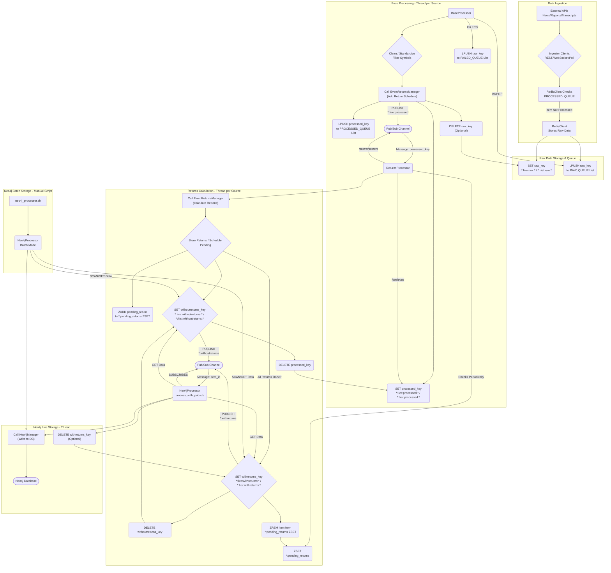

# EventTrader Data Flow Documentation

**Executive Summary:** This document details the pipeline for ingesting, processing, and storing financial event data (news, reports, transcripts) in the EventTrader system. It utilizes Redis for queuing and state management through distinct stages (raw, processed, returns calculation) driven by Pub/Sub messaging, ultimately storing enriched data in Neo4j, while providing mechanisms to track item lifecycles and manage historical data batches.

## 1. Overview

The EventTrader system ingests financial news (Benzinga), SEC reports, and earnings call transcripts, processes this data through a Redis-based pipeline involving cleaning, metadata enrichment, and financial returns calculation, and finally stores the structured data and relationships in a Neo4j graph database.

The primary flow involves:
1.  **Ingestion:** Fetching data from external APIs (REST/WebSocket/Polling).
2.  **Redis Raw Storage & Queuing:** Storing raw data under a unique key in Redis and adding the key name to a processing queue (**`RAW_QUEUE`**). Includes deduplication checks against previously processed items.
3.  **Base Processing:** Consuming keys from the **`RAW_QUEUE`**, retrieving raw data, cleaning/standardizing it, filtering by a defined symbol universe, adding metadata (including return calculation schedules using **`EventReturnsManager`**), storing the processed data under a new key (**`processed`** state), adding the key name to a **`PROCESSED_QUEUE`** list (for deduplication), and publishing the processed key name via Redis Pub/Sub (**`*:live:processed`** channel).
4.  **Returns Calculation:** Listening to the processed items Pub/Sub channel, retrieving processed data, calculating available financial returns (hourly, session, daily) using **`EventReturnsManager`** as market data becomes available (scheduling future calculations via a Redis Sorted Set **`*:pending_returns`**), updating the stored item with calculated returns, moving the item to **`withreturns`**/**`withoutreturns`** states, and publishing the item ID via Redis Pub/Sub (**`*:withreturns`**/**`*:withoutreturns`** channels).
5.  **Neo4j Storage:** Listening to the returns calculation Pub/Sub channels, retrieving the final data (with returns), creating/updating nodes and relationships in Neo4j, and potentially cleaning up the final Redis key.

Separate handling exists for live streaming data and batch historical data ingestion, primarily distinguished by the **`live:`** vs **`hist:`** Redis key prefix. The system aims to track each item from ingestion to final storage or failure.

## 2. Core Components

*   **`config/DataManagerCentral.py` (`DataManager`):** The central orchestrator. Initializes and starts all other components (ingestors, processors, returns calculator, Neo4j listener) based on configuration (live/historical). Manages startup and shutdown.
*   **Source Managers (`BenzingaNewsManager`, `ReportsManager`, `TranscriptsManager` in `DataManagerCentral.py`):** Manage specific data sources (news, reports, transcripts). Initialize API clients, Redis instances (via **`EventTraderRedis`**), the corresponding **`BaseProcessor`** subclass, and the **`ReturnsProcessor`**. Launched by **`DataManager`**.
*   **Ingestors (`benzinga/`, `secReports/`, `transcripts/`):** Fetch data from external sources.
    *   **Benzinga/SEC:** Use WebSocket clients (**`bz_websocket.py`**, **`sec_websocket.py`**) for live data and REST API clients (**`bz_restAPI.py`**, **`sec_restAPI.py`**) for historical data. Interact with **`RedisClient`** to store raw data and queue items.
    *   **Transcripts:** Uses **`EarningsCallProcessor`** for fetching data (polling/scheduling for live, REST for historical). Interacts with **`RedisClient`**.
*   **`redisDB/redisClasses.py` (`EventTraderRedis`, `RedisClient`):** Manages Redis connections (live, hist, admin). Provides methods for storing data (`SET`), managing queues (`LPUSH`/`BRPOP` on Lists), Pub/Sub, Sorted Sets (`ZADD`/`ZRANGEBYSCORE`), and key management using standardized namespaces. Performs deduplication check against **`PROCESSED_QUEUE`** list before adding new raw items.
*   **`redisDB/BaseProcessor.py` (`BaseProcessor`):** Abstract base class for initial data processing. Runs in a dedicated thread per source type. Consumes `raw_key` names from the **`RAW_QUEUE`** list, retrieves raw data, cleans/standardizes, filters by symbols, adds metadata/schedules (via **`EventReturnsManager`**), stores result under a **`processed_key`**, pushes `processed_key` to **`PROCESSED_QUEUE`** list, publishes `processed_key` to **`*:live:processed`** Pub/Sub, and optionally deletes the original **`raw_key`**. Pushes failed `raw_key`s to **`FAILED_QUEUE`** list upon exceptions.
*   **`redisDB/NewsProcessor.py`, `ReportProcessor.py`, `TranscriptProcessor.py`:** Subclasses of **`BaseProcessor`**. Implement source-specific data cleaning (`_clean_content`) and standardization (`_standardize_fields`).
*   **`eventReturns/EventReturnsManager.py` (`EventReturnsManager`):** Utility class providing methods for:
    *   `process_event_metadata`: Called by **`BaseProcessor`** to generate return *schedules* based on event time.
    *   `process_events`: Called by **`ReturnsProcessor`** to calculate actual financial *returns* based on schedules and market data availability (using **`polygonClass.py`**).
*   **`eventReturns/ReturnsProcessor.py` (`ReturnsProcessor`):** Calculates financial returns. Runs in a dedicated thread per source type. Listens to **`*:live:processed`** Pub/Sub for processed items. Calculates available returns (using **`EventReturnsManager`**), schedules future calculations in **`*:pending_returns`** ZSET, updates items, stores updated data under **`*:withreturns:*`** or **`*:withoutreturns:*`** keys (deleting the **`*:processed:*`** key), and publishes `item_id` to **`*:withreturns`**/**`*:withoutreturns`** Pub/Sub channels. Periodically checks the ZSET to process scheduled returns. **Note:** Potential failures (e.g., Polygon errors) might leave items stuck in **`withoutreturns`** state without automatic recovery.
*   **`neograph/Neo4jProcessor.py` (`Neo4jProcessor`):** Handles interaction with Neo4j.
    *   **Live Mode:** Runs `process_with_pubsub` (via **`PubSubMixin`**, started by **`DataManager`**) listening to **`*:withreturns`**/**`*:withoutreturns`** Pub/Sub, retrieves data from Redis, calls **`Neo4jManager`** to write. May delete **`*:withreturns:*`** key on success. **Note:** Needs robust handling for Neo4j write failures (retry, logging) to prevent data loss after Pub/Sub consumption (not explicitly detailed in reviewed code).
    *   **Batch Mode:** Provides functions executable via command line (**`neo4j_processor.sh`**) to process data directly from Redis (primarily **`*:withreturns:*`**, **`*:withoutreturns:*`** states) into Neo4j.
*   **`neograph/Neo4jManager.py` (`Neo4jManager`):** Executes Cypher queries against Neo4j (creating/merging nodes/relationships). Called by **`Neo4jProcessor`**.
*   **`neograph/Neo4jInitializer.py` (`Neo4jInitializer`):** Sets up Neo4j schema (constraints, indexes, initial nodes). Run by **`DataManager`** on startup if needed.
*   **`scripts/run_event_trader.py`:** Main script to start the **`DataManager`**. Handles command-line args.
*   **`scripts/*.sh`:** Helper scripts for running the application, batch processing, etc.

## 3. Live Data Ingestion: WebSocket vs. Scheduled/Polled

A key difference exists in how live data enters the system:

*   **News & Reports (Benzinga/SEC): WebSocket Push**
    *   Utilize persistent WebSocket connections (**`bz_websocket.py`**, **`sec_websocket.py`**).
    *   External providers push data in real-time.
    *   **`DataManager`** manages dedicated WebSocket client threads.
    *   **Result:** Low-latency, event-driven ingestion.

*   **Transcripts: Scheduled/Polled Fetch**
    *   **No WebSocket.** Relies on fetching data based on known schedules or polling.
    *   **Scheduling:** **`TranscriptsManager`** fetches earnings calendar, schedules processing times (call time + 30 min) in Redis ZSET (**`admin:transcripts:schedule`**).
    *   **Fetching Trigger:** Exact live fetch trigger mechanism is less clear in reviewed core code. May involve monitoring the ZSET, periodic polling, or manual triggers.
    *   **Result:** Higher latency, dependent on scheduling and fetch trigger timing.

This difference impacts the real-time availability of transcript data compared to news and SEC filings.

## 4. Data Flow Diagram (Mermaid)

## 5. Redis Usage Details

Redis is central to the workflow, used for queuing, intermediate data storage, state management, and inter-process communication.

*   **Key Namespaces & States:** Keys structure: `{source}:{prefix}:{state}:{id}`.
    *   `source`: **`news`**, **`reports`**, **`transcripts`**.
    *   `prefix`: **`live`**, **`hist`**. (Distinguishes real-time vs. historical).
    *   `state`: Represents processing stage:
        *   **`raw`**: Initial data via `SET`. Deleted by **`BaseProcessor`** (optional).
        *   **`processed`**: Cleaned data + metadata/schedule via `SET`. Deleted by **`ReturnsProcessor`**.
        *   **`withoutreturns`**: Returns calculation in progress/pending via `SET`. Deleted by **`ReturnsProcessor`** on full completion.
        *   **`withreturns`**: Final state (all returns calculated) via `SET`. May be deleted by **`Neo4jProcessor`** (live mode) after successful Neo4j write.
    *   `id`: Unique item identifier (e.g., `newsId.timestamp`, `accessionNo.timestamp`, `symbol_timestamp`).
*   **Queues (Redis Lists):**
    *   `{source}:queues:raw` (**`RAW_QUEUE`**): Stores `raw_key` names. Pushed by ingestors (`LPUSH`), consumed by **`BaseProcessor`** (`BRPOP`). Primary work queue.
    *   `{source}:queues:processed` (**`PROCESSED_QUEUE`**): Stores `processed_key` names. Pushed by **`BaseProcessor`** (`LPUSH`). Primarily used by **`RedisClient`** for deduplication checks before adding new raw items. Not typically consumed.
    *   `{source}:queues:failed` (**`FAILED_QUEUE`**): Stores `raw_key` names of items failing in **`BaseProcessor`**. Pushed by **`BaseProcessor`** (`LPUSH`). **Note:** No automatic retry; requires manual investigation/recovery.
*   **Pub/Sub Channels:** For event-driven notifications.
    *   `{source}:live:processed`: **`BaseProcessor`** publishes `processed_key` name. **`ReturnsProcessor`** subscribes.
    *   `{source}:withreturns`, `{source}:withoutreturns`: **`ReturnsProcessor`** publishes `item_id`. **`Neo4jProcessor`** (live mode) subscribes.
*   **Sorted Set (ZSET):**
    *   `{source}:pending_returns` (**`*:pending_returns`**): Used by **`ReturnsProcessor`** to schedule future return calculations. Members: `{item_id}:{return_type}`. Score: Unix timestamp when market data should be available. Checked via `ZRANGEBYSCORE`.
*   **Other Keys:**
    *   **`admin:*`**: Used by **`EventTraderRedis`** for shared config (stock universe: **`admin:tradable_universe:*`**) and transcript scheduling (**`admin:transcripts:schedule`**).

## 6. Tracking Item Lifecycle Summary Table

This table summarizes the typical happy-path journey of an item:

| Stage                      | Redis State/Action                                  | Responsible Component | Trigger                 | Output / Next Step                                  |
| :------------------------- | :-------------------------------------------------- | :-------------------- | :---------------------- | :-------------------------------------------------- |
| 1. Ingestion               | Check `PROCESSED_QUEUE`, `SET *:raw:*`, `LPUSH RAW_QUEUE` | Ingestor / RedisClient | External Data / API Call | `raw_key` in `RAW_QUEUE`                             |
| 2. Base Processing Start   | `BRPOP RAW_QUEUE`                                     | BaseProcessor         | Item in `RAW_QUEUE`     | Get raw data                                        |
| 3. Base Processing Success | `DEL *:raw:*`(opt), `SET *:processed:*`, `LPUSH PROCESSED_QUEUE`, `PUBLISH *:live:processed` | BaseProcessor | Successful Processing | `processed_key` published                             |
| 4. Returns Calc Start      | `GET *:processed:*`, `DEL *:processed:*`, `SET *:withoutreturns:*`, `PUBLISH *:withoutreturns`, `ZADD *:pending_returns` | ReturnsProcessor    | Pub/Sub `*:live:processed` | `item_id` published, future returns scheduled       |
| 5. Pending Return Calc     | `GET *:withoutreturns:*`, Calc Return, `SET *:withoutreturns:*`, `PUBLISH *:withoutreturns` | ReturnsProcessor    | ZSET Check (`ZRANGEBYSCORE`) | Item updated, `item_id` published                  |
| 6. All Returns Calc        | `GET *:withoutreturns:*`, Calc Final Return, `DEL *:withoutreturns:*`, `SET *:withreturns:*`, `PUBLISH *:withreturns`, `ZREM *:pending_returns` | ReturnsProcessor    | Last Pending Return Calc | Item moved to final state, `item_id` published      |
| 7. Neo4j Ingestion (Live)  | `GET *:withreturns:*`/`*:withoutreturns:*`, Write to DB, `DEL *:withreturns:*` (opt.) | Neo4jProcessor (Live) | Pub/Sub `*:withreturns`/etc. | Data in Neo4j, optional Redis cleanup            |
| 8. Neo4j Ingestion (Batch) | `SCAN/GET *:withreturns:*`/`*:withoutreturns:*`, Write to DB | Neo4jProcessor (Batch)| Manual Script Run      | Data in Neo4j                                     |

**Failure Paths:**
*   If Stage 3 fails -> `raw_key` pushed to **`FAILED_QUEUE`**. Processing stops.
*   If Stage 4/5/6 fails -> Item might remain stuck in **`withoutreturns`** state indefinitely.
*   If Stage 7 fails -> Data might not reach Neo4j; depends on retry logic. `withreturns` key might not be cleaned up.

## 7. Historical Data Ingestion

*   **Trigger:** Initiated by **`scripts/run_event_trader.py`** with `--from-date` and `--to-date`. The **`hist:`** prefix is used in Redis.
*   **Fetching:** Source managers call REST clients (`get_historical_data`).
*   **Storage & Queuing:** Data stored under **`*:hist:raw:*`** keys, keys pushed to **`RAW_QUEUE`**.
*   **Processing:** Flows through the same **`BaseProcessor`** and **`ReturnsProcessor`** instances.
    *   **`BaseProcessor`** creates **`*:hist:processed:*`** keys, pushes to **`PROCESSED_QUEUE`**, publishes key to **`*:live:processed`**.
    *   **`ReturnsProcessor`** handles these via its batch scan (`_process_hist_news`), creates **`*:hist:withreturns:*`** or **`*:hist:withoutreturns:*`** keys (deleting **`*:hist:processed:*`**), schedules in ZSET, and publishes `item_id` to **`*:withreturns`**/**`*:withoutreturns`**.
*   **Neo4j Loading:** Can be picked up by the live **`Neo4jProcessor`** listener or processed in bulk using the manual **`neo4j_processor.sh`** script (reading from **`*:hist:withreturns:*`** / **`*:hist:withoutreturns:*`**).
*   **Potential Live/Historical Duplicates:** The deduplication check using the **`PROCESSED_QUEUE`** list operates within the **`live:`** or **`hist:`** prefix scope. If the same event is ingested via both live and historical runs, it might be processed in both namespaces, potentially leading to duplicates in Neo4j unless idempotent writes (e.g., Cypher `MERGE` with proper constraints) are used in **`Neo4jManager`**.

## 8. Proposed Solution: Tracking Historical Batch Completion (Reconciliation)

To reliably know when to start the next historical batch fetch, this plan focuses on confirming that all items successfully queued by **`RedisClient`** for the current batch have been fully accounted for by **`BaseProcessor`**. This ensures the input and initial processing stage is clear before fetching more data.

**1. Define Item Pathways (Queuing Attempt to BaseProcessor Outcome):**

Once a historical fetch function completes (signaled by `fetch_complete`), items attempt to enter the `RAW_QUEUE` via `RedisClient` and are then handled by `BaseProcessor`. We track the following pathways:

*   **A. Pre-BaseProcessor (Within `RedisClient` queuing methods like `set_news`, `set_filing`):**
    *   **Pathway 1: Deduplicated:** Item skipped because its `processed_key` is already in the `PROCESSED_QUEUE` list. (Handled by: `RedisClient` methods).
    *   **Pathway 2: Queueing Failed:** Redis `SET`+`LPUSH` pipeline fails. Item not queued. (Handled by: `RedisClient` methods).
    *   **Pathway 3: Queued Successfully:** Redis `SET`+`LPUSH` succeeds. Item's `raw_key` added to `RAW_QUEUE`. (Handled by: `RedisClient` methods). **This is the input count for BaseProcessor.**

*   **B. BaseProcessor Handling (Within `BaseProcessor._process_item` for items popped from `RAW_QUEUE`):**
    *   **Pathway 4: Failed (Raw Missing):** `client.get(raw_key)` returns `None` upon attempt. (Handled by: `_process_item` initial check).
    *   **Pathway 5: Filtered (Symbols):** `_has_valid_symbols` check fails. (Handled by: `_process_item` symbol check logic).
    *   **Pathway 6: Failed (Processing Error):** Exception during processing (cleaning, metadata, Redis save) or `_add_metadata` returns `None`. Item pushed to `FAILED_QUEUE`. (Handled by: `_process_item` main try/except block).
    *   **Pathway 7: Skipped (Already Processed):** `processed_key` already exists or is in `PROCESSED_QUEUE` list upon check *within BaseProcessor*. (Handled by: `_process_item` duplicate check before saving).
    *   **Pathway 8: Passed (Processed Successfully):** Item successfully processed, `processed_key` saved, pushed to `PROCESSED_QUEUE`, and published. (Handled by: `_process_item` successful execution path).

**2. Minimal Counters for Reconciliation:**

To perform the reconciliation, the following counters must be incremented **only for items identified as belonging to the active historical batch** (`batch_id`):

*   **Input:** `batch:{batch_id}:rc_queued_success`
    *   **Incremented In:** `RedisClient` methods (`set_news`, `set_filing`, etc.)
    *   **When:** Pathway 3 (Successful `SET`+`LPUSH` to `RAW_QUEUE`).
*   **BP Outcomes:**
    *   `batch:{batch_id}:bp_filtered`
        *   **Incremented In:** `BaseProcessor._process_item`
        *   **When:** Pathway 5 (Filtered by symbols).
    *   `batch:{batch_id}:bp_failed`
        *   **Incremented In:** `BaseProcessor._process_item`
        *   **When:** Pathway 4 (Raw Missing) OR Pathway 6 (Processing Error).
    *   `batch:{batch_id}:bp_skipped_dupe`
        *   **Incremented In:** `BaseProcessor._process_item`
        *   **When:** Pathway 7 (Skipped as already processed by another worker).
    *   `batch:{batch_id}:bp_processed`
        *   **Incremented In:** `BaseProcessor._process_item`
        *   **When:** Pathway 8 (Successfully processed).

**3. Details: Setting the Fetch Completion Flag**

To establish a 100% reliable mechanism for knowing when the historical fetch function for each source has completed its work and queued the last item, the `batch:{batch_id}:fetch_complete` flag is set within each function at a specific point ensuring all processing is finished:

*   **News (`BenzingaNewsRestAPI._fetch_news`):**
    *   *Current Flow:* This function fetches data page by page, collects items, and uses `self.redis.history_client.set_news_batch(...)` to push them to Redis, potentially with a final call after the main loop.
    *   *Reliable Signal:* The `SET batch:{batch_id}:fetch_complete 1 EX 86400` command is added **immediately after** the logic that saves the *final* batch of news items to Redis (typically after the pagination loop concludes).

*   **Reports (`SECRestAPI.get_historical_data`):**
    *   *Current Flow:* This function iterates through tickers, and within that, potentially paginates filings, pushing each individually using `self.redis.history_client.set_filing(...)`.
    *   *Reliable Signal:* The `SET batch:{batch_id}:fetch_complete 1 EX 86400` command is added **immediately after** the main outer loop (iterating through all `tickers`) finishes, ensuring all tickers for the batch have been processed.

*   **Transcripts (`TranscriptsManager._fetch_historical_data`):**
    *   *Current Flow:* This function loops through each date in the batch range (`while current_date <= end_date:`), fetches transcripts for the date, and pushes each individually (`store_transcript_in_redis(...)`).
    *   *Reliable Signal:* The `SET batch:{batch_id}:fetch_complete 1 EX 86400` command is added **immediately after** the main `while current_date <= end_date:` loop finishes, guaranteeing all dates in the range were attempted.

**3.1 Implementation Summary:**
    *   Modify the 3 historical fetch functions to accept `batch_id` and set `batch:{batch_id}:fetch_complete 1 EX 86400` at their conclusion (as detailed above).
    *   Modify `RedisClient` queuing methods (`set_news`, `set_filing`, etc.) to accept `batch_id` (if provided) and increment `rc_queued_success` upon successful queuing.
    *   Modify `BaseProcessor._process_item` to identify active historical batch items and increment the appropriate outcome counters (`bp_filtered`, `bp_failed`, `bp_skipped_dupe`, `bp_processed`) based on the execution path taken.

**4. Orchestrator Logic (Queue-to-Processed Reconciliation Check):**
    *   An external orchestrator script manages sequential batch iterations.
    *   For each batch (`batch_id = "{source_type}:{start_date_str}-{end_date_str}"):
        *   **Prepare:** Clear `fetch_complete` flag. Reset/clear batch counters (`rc_queued_success`, `bp_*`). Set `current_hist_batch:{source_type}` flag.
        *   **Trigger Fetch:** Call historical fetch function (passing `batch_id`).
        *   **Monitor & Reconcile:** Periodically check Redis:
            1.  `GET batch:{batch_id}:fetch_complete` must be '1'.
            2.  `LLEN {source_type}:queues:raw` must be 0 (stable).
            3.  Fetch counter values: `queued = GET ...:rc_queued_success`, `filtered = GET ...:bp_filtered`, `failed = GET ...:bp_failed`, `skipped = GET ...:bp_skipped_dupe`, `processed = GET ...:bp_processed`. Handle missing as 0.
            4.  **Reconciliation Check:** Verify `(filtered + failed + skipped + processed) >= queued`.
        *   **Trigger Next Batch When:** All conditions (1, 2, and 4) are met consistently for a stability period.
        *   **Failure/Timeout:** Handle timeouts. Log errors if reconciliation fails. Note: This doesn't track items discarded *before* queueing (e.g., by Error Handlers or RedisClient dedupe).
        *   **Cleanup:** On success, clear `current_hist_batch` flag, optionally clear batch keys, proceed.

This approach ensures that all data successfully entering the Redis queueing stage is accounted for by the BaseProcessor before starting the next batch fetch, providing a robust control mechanism with high visibility into the critical initial processing stages.