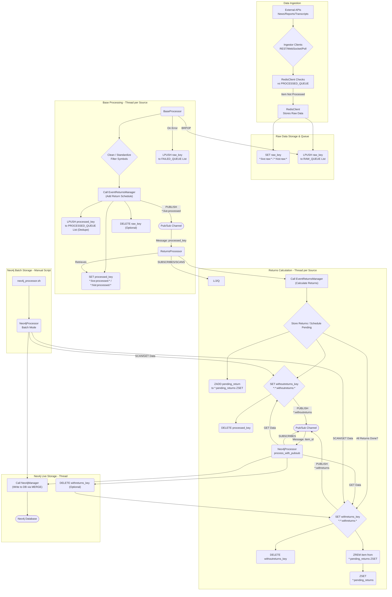

## 4. Data Flow Diagram (Mermaid)

*(Note: This diagram provides a high-level overview. Refer to text descriptions for precise details like queue names and Pub/Sub channels.)*

```mermaid
graph TD
    subgraph Ingestion [Data Ingestion]
        A[External APIs<br>News/Reports/Transcripts] --> B{Ingestor Clients<br>REST/WebSocket/Poll};
        B --> C["RedisClient Checks<br>vs PROCESSED_QUEUE"];
        C -- Item Not Processed --> D["RedisClient<br>Stores Raw Data"];
    end

    subgraph Redis Raw [Raw Data Storage & Queue]
        D --> E("SET raw_key<br>*:live:raw:* / *:hist:raw:*");
        D --> F("LPUSH raw_key<br>to RAW_QUEUE List");
    end

    subgraph Base Processing [Base Processing - Thread per Source]
        G("BaseProcessor") -- BRPOP --> F;
        G --> H{"Clean / Standardize<br>Filter Symbols"};
        H --> I["Call EventReturnsManager<br>(Add Return Schedule)"];
        I --> J("SET processed_key<br>*:live:processed:* / *:hist:processed:*");
        I --> K("LPUSH processed_key<br>to PROCESSED_QUEUE List (Dedupe)");
        I -- PUBLISH<br>*:live:processed --> L([Pub/Sub Channel]);
        L -- Message: processed_key --> P;
        I --> M("DELETE raw_key (Optional)");
        G -- On Error --> N("LPUSH raw_key<br>to FAILED_QUEUE List");
    end

    subgraph Returns Calc [Returns Calculation - Thread per Source]
        P("ReturnsProcessor") -- SUBSCRIBES/SCANS --> L/J/Q;
        P -- Retrieves --> J;
        P --> R["Call EventReturnsManager<br>(Calculate Returns)"];
        R --> S{"Store Returns / Schedule Pending"};
        S --> T("ZADD pending_return<br>to *:pending_returns ZSET");
        S --> U{"SET withoutreturns_key<br>*:*:withoutreturns:*" };
        U --> V("DELETE processed_key");
        U -- PUBLISH<br>*:withoutreturns --> W([Pub/Sub Channel]);
        W -- Message: item_id --> Z;
        S -- All Returns Done? --> X{"SET withreturns_key<br>*:*:withreturns:*"};
        X --> Y("DELETE withoutreturns_key");
        X --> ZREM("ZREM item from<br>*:pending_returns ZSET");
        ZREM --> Q;
        X -- PUBLISH<br>*:withreturns --> W;
        Q(ZSET<br>*:pending_returns);
    end

    subgraph Neo4j Live [Neo4j Live Storage - Thread]
        Z("Neo4jProcessor<br>process_with_pubsub") -- SUBSCRIBES --> W;
        Z -- GET Data --> U;
        Z -- GET Data --> X;
        Z --> AA["Call Neo4jManager<br>(Write to DB via MERGE)"];
        AA --> BB([Neo4j Database]);
        Z --> CC("DELETE withreturns_key (Optional)");
        CC --> X;
    end

    subgraph Neo4j Batch [Neo4j Batch Storage - Manual Script]
        DD["neo4j_processor.sh"] --> EE("Neo4jProcessor<br>Batch Mode");
        EE -- SCAN/GET Data --> U;
        EE -- SCAN/GET Data --> X;
        EE --> AA;
    end

```