# Neo4j EventMarketDB Complete Schema Reference

## 🎯 Quick Reference Format
```
NodeLabel [*indexed_field, normal_field?, LIST:list_field] 
└─(RELATIONSHIP_NAME){property1, property2?}→ TargetNode

Legend:
* = indexed field (unique constraint)
? = optional property (not present on all nodes/relationships)
{} = relationship properties
→ = relationship direction
LIST: = array/list type field
FULLTEXT: = fulltext indexed field
VECTOR: = vector indexed field
```

## 📈 Return Properties on Relationships
```
Return Timeframes:
- hourly_*: 1-hour return after event
- session_*: Market session return (pre/regular/post)
- daily_*: Full trading day return

Return Levels:
- *_stock: Individual company return
- *_industry: Industry-level return
- *_sector: Sector-level return  
- *_macro: Market index return (SPY)

Note: Return properties are often optional and sometimes missing
```

## 📊 Market Structure Hierarchy

### MarketIndex
```
MarketIndex [*id, ticker, etf, name]
Total instances: ~1

Relationships:
├─(BELONGS_TO)← Sector (11 instances)
├─(HAS_PRICE)← Date (641 instances)
└─(INFLUENCES)← Report/Transcript/News (212,682 instances)
```

### Sector
```
Sector [*id, etf, name]
Total instances: ~11

Relationships:
├─(BELONGS_TO)→ MarketIndex (11 instances)
├─(BELONGS_TO)← Industry (115 instances)
├─(HAS_PRICE)← Date (7,049 instances)
└─(INFLUENCES)← Report/Transcript/News (212,682 instances)
```

### Industry
```
Industry [*id, sector_id, etf, name]
Total instances: ~115

Relationships:
├─(BELONGS_TO)→ Sector (115 instances)
├─(BELONGS_TO)← Company (796 instances)
├─(HAS_PRICE)← Date (33,278 instances)
└─(INFLUENCES)← Report/Transcript/News (212,702 instances)
```

### Company
```
Company [*id, cik, ticker, symbol, name, displayLabel, exchange,
         sector, industry, industry_normalized, sector_etf, industry_etf,
         mkt_cap, shares_out, employees, fiscal_year_end_month, fiscal_year_end_day]
Total instances: 796
Note: All properties always present. employees stored as string with commas (e.g., "6,600")

Relationships:
├─(BELONGS_TO)→ Industry (796 instances)
├─(RELATED_TO){source_ticker, target_ticker, relationship_type, bidirectional}→ Company (2,109 instances)
│  Note: bidirectional=true but stored as single edge, not reciprocal
├─(HAS_TRANSCRIPT)→ Transcript (3,716 instances)
├─(DECLARED_DIVIDEND)→ Dividend (4,271 instances)
├─(DECLARED_SPLIT)→ Split (33 instances)
├─(PRIMARY_FILER)← Report (30,699 instances)
├─(REFERENCED_IN)← Report (949 instances)
├─(FOR_COMPANY)← Context (2,283,340 instances)
├─(HAS_PRICE)← Date (507,595 instances)
└─(INFLUENCES)← Transcript/News (181,065 instances)
```

## 📄 Financial Reporting Structure

### Report
```
Report [*id, cik?, accessionNo, formType, periodOfReport?, created,
        isAmendment(BOOLEAN), xbrl_status?, xbrl_error?, returns_schedule,
        market_session, is_xml(BOOLEAN), items?, entities, symbols, description?,
        linkToHtml, linkToTxt, linkToFilingDetails, primaryDocumentUrl,
        exhibits?, exhibit_contents?, extracted_sections?, financial_statements?, 
        effectivenessDate?]
Total instances: 31,618

Property presence:
- cik: missing in 918 instances (~3%)
- periodOfReport: missing in 999 instances (~3%)
- items: present in 24,166 instances (~76%)
- description: missing in some instances
- exhibits: missing in some instances
- exhibit_contents: varies
- extracted_sections: varies
- financial_statements: present in 7,275 instances (~23%)
- effectivenessDate: present in 7 instances only
- xbrl_status/xbrl_error: varies based on processing

Relationships:
├─(PRIMARY_FILER){symbol, created_at, daily_stock?, hourly_stock?, session_stock?,
│                 daily_industry?, hourly_industry?, session_industry?,
│                 daily_sector?, hourly_sector?, session_sector?,
│                 daily_macro, hourly_macro, session_macro?}→ Company (30,699 instances)
│  Missing properties:
│  - daily_stock: missing in 610 instances (~2%)
│  - session_stock: missing in 613 instances (~2%)
│  - daily_industry: missing in 46 instances
│  - session_industry: missing in 177 instances
│  - hourly_* can be Double or DoubleArray
├─(REFERENCED_IN){symbol, created_at, daily_stock?, hourly_stock?, session_stock?,
│                 daily_industry?, hourly_industry?, session_industry?,
│                 daily_sector?, hourly_sector?, session_sector?,
│                 daily_macro, hourly_macro, session_macro?}→ Company (949 instances)
│  Note: ~6.5% missing various return properties
├─(HAS_XBRL)→ XBRLNode (6,114 instances - only 10-K and 10-Q reports)
├─(IN_CATEGORY)→ AdminReport (31,617 instances)
├─(HAS_SECTION)→ ExtractedSectionContent (144,813 instances)
├─(HAS_EXHIBIT)→ ExhibitContent (28,568 instances)
├─(HAS_FINANCIAL_STATEMENT)→ FinancialStatementContent (28,239 instances)
├─(HAS_FILING_TEXT)→ FilingTextContent (1,703 instances)
└─(INFLUENCES){various return properties}→ Industry/Sector/MarketIndex (94,871 instances)
   Note: Report NEVER INFLUENCES Company (0 instances)
```

### Financial Data Storage Methods

Financial data in reports is stored in three distinct ways:

1. **XBRL Data (Highly Structured)** - 10-K and 10-Q ONLY
   - ~8M individual tagged facts with specific accounting concepts
   - Accessed via: Report → HAS_XBRL → XBRLNode ← REPORTS ← Fact
   - Supports dimensional analysis (segments, geography)
   - Example concepts: us-gaap:RevenueFromContractWithCustomerExcludingAssessedTax

2. **JSON Financial Statements** - Report.financial_statements property
   - Large JSON strings (50KB-1.7MB)
   - Semi-structured format
   - Available for various report types
   - Present in ~23% of reports (7,275 instances)

3. **Extracted Section Content** - Narrative Text
   - Text extracted from report sections
   - Available for ALL report types (8-K, 10-K, 10-Q, etc.)
   - Accessed via: Report → HAS_SECTION → ExtractedSectionContent
   - Common sections:
     - 10-K/10-Q: FinancialStatements, ManagementDiscussionandAnalysis, RiskFactors
     - 8-K: ResultsofOperationsandFinancialCondition, OtherEvents, EntryintoaMaterialDefinitiveAgreement

### Key Differences Between XBRL and Non-XBRL Data

**XBRL (10-K/10-Q only):**
- Highly structured, machine-readable financial facts
- Each fact has specific accounting concept (e.g., us-gaap:NetIncomeLoss)
- Supports precise queries for specific line items
- Enables calculations and dimensional analysis
- ~8M individual facts in the database

**Non-XBRL (All report types including 8-K):**
- Narrative text in ExtractedSectionContent
- Requires text search/parsing to find financial information
- Contains management discussion, analysis, and explanations
- 8-K reports ONLY have narrative sections, never XBRL

**Important Access Patterns:**
- For specific metrics (revenue, EPS, assets): Use XBRL (10-K/10-Q only)
- For discussions/analysis: Use ExtractedSectionContent (all reports)
- For 8-K events: Must use ExtractedSectionContent sections
- JSON financial_statements: Semi-structured alternative (when available)

### AdminReport
```
AdminReport [*id, category, code, label, displayLabel]
Total instances: ~16

Relationships:
└─(HAS_SUB_REPORT)→ AdminReport (8 instances)
```

### Content Nodes
```
ExtractedSectionContent [*id, section_name, content, content_length,
                        form_type, filer_cik?, filed_at, filing_id]
Total instances: ~144,813
Note: filer_cik missing in 3,648 instances

Common section_name values by form type:
- 10-K: Business, RiskFactors, FinancialStatementsandSupplementaryData,
        Management'sDiscussionandAnalysisofFinancialConditionandResultsofOperations
- 10-Q: FinancialStatements, ManagementDiscussionandAnalysis, 
        QuantitativeandQualitativeDisclosuresAboutMarketRisk
- 8-K: ResultsofOperationsandFinancialCondition, FinancialStatementsandExhibits,
       DepartureofDirectorsorCertainOfficers, OtherEvents, EntryintoaMaterialDefinitiveAgreement,
       SubmissionofMatterstoaVoteofSecurityHolders, CreationofaDirectFinancialObligation,
       AmendmentstoArticlesofIncorporationorBylaws, UnregisteredSalesofEquitySecurities,
       CompletionofAcquisitionorDispositionofAssets, MaterialImpairments
       (Note: 8-K has 20+ possible section types)

ExhibitContent [*id, exhibit_number, content, form_type, filer_cik?,
                filed_at, filing_id]
Total instances: ~28,568
Note: filer_cik missing in 939 instances

FinancialStatementContent [*id, statement_type, value, form_type,
                          filer_cik, filed_at, filing_id]
Total instances: ~28,239
Note: filer_cik always present

FilingTextContent [*id, content, form_type, filer_cik?, filed_at, filing_id]
Total instances: ~1,703
Note: filer_cik missing in 917 instances
```

## 🔢 XBRL Data Model

**IMPORTANT**: XBRL data is ONLY available for 10-K and 10-Q reports. Other report types (8-K, etc.) do NOT have XBRL.

**XBRL Coverage:**
- Total Reports: 31,618
- Reports with XBRL: 6,114 (~19%)
- All are 10-K or 10-Q reports
- No 8-K reports have XBRL

### XBRLNode
```
XBRLNode [*id, cik, accessionNo, report_id, displayLabel, primaryDocumentUrl]
Total instances: ~6,114

Relationships:
├─(HAS_XBRL)← Report (6,114 instances)
└─(REPORTS)← Fact (7,685,180 instances)
```

### Fact
```
Fact [*id, fact_id, u_id, qname, value, decimals?, is_numeric, is_nil,
      context_id, period_ref, concept_ref, unit_ref?]
Total instances: ~7.69M
Note: is_numeric uses string values '1' (6,921,534) or '0' (763,415)

Relationships:
├─(REPORTS){report_id, company_cik}→ XBRLNode (7,685,180 instances)
├─(HAS_CONCEPT){key}→ Concept (7,685,181 instances)
├─(HAS_PERIOD){key}→ Period (7,685,180 instances)
├─(HAS_UNIT){key}→ Unit (6,921,712 instances)
├─(IN_CONTEXT)→ Context (7,788,552 instances)
├─(FACT_DIMENSION)→ Dimension (14,241 instances)
├─(FACT_MEMBER)→ Member (6,962,595 instances)
├─(CALCULATION_EDGE){all 11 properties mandatory}→ Fact (1,920,707 instances)
└─(PRESENTATION_EDGE)← Abstract (never happens - 0 instances)
```

### Concept & Abstract
```
Concept [*id, u_id, qname, label, namespace, category, type_local,
         balance?, period_type?, concept_type]
Total instances: ~1.75M

Abstract [*id, u_id, qname, label, namespace, category, type_local,
          balance?, period_type?, concept_type]
Total instances: ~150K

Abstract relationships:
└─(PRESENTATION_EDGE){all 11 properties mandatory}→ Fact (6,363,861 instances)
└─(PRESENTATION_EDGE){all 11 properties mandatory}→ Abstract (208,446 instances)
```

### Time & Units
```
Period [*id, u_id, period_type, start_date?, end_date?]
Total instances: ~1.67M

Relationships:
├─(HAS_PERIOD)← Fact (7,685,180 instances)
└─(HAS_PERIOD)← Context (2,283,340 instances)

Unit [*id, u_id, unit_reference, name, status, is_simple_unit,
      is_divide, item_type?, namespace?, registry_id?]
Total instances: ~125K

Relationships:
└─(HAS_UNIT)← Fact (6,921,712 instances)
```

### Context
```
Context [*id, u_id, context_id, cik, period_u_id, 
         LIST:member_u_ids, LIST:dimension_u_ids]
Total instances: ~2.28M

Relationships:
├─(HAS_PERIOD)→ Period (2,283,340 instances)
├─(FOR_COMPANY)→ Company (2,283,340 instances)
└─(IN_CONTEXT)← Fact (7,788,552 instances)
```

### Dimensional Model
```
Dimension [*id, u_id, qname, name, label, is_explicit, is_typed, network_uri]
Total instances: ~5K

Relationships:
├─(HAS_DOMAIN)→ Domain (95,013 instances)
├─(HAS_DOMAIN)→ Member (54 instances)
└─(FACT_DIMENSION)← Fact (14,241 instances)

Domain [*id, u_id, qname, label, level, parent_qname?]
Total instances: ~500

Relationships:
├─(HAS_MEMBER)→ Member (679,684 instances)
├─(HAS_MEMBER)→ Domain (68 instances)
├─(PARENT_OF)→ Member (345 instances)
└─(HAS_DOMAIN)← Dimension (95,013 instances)

Member [*id, u_id, qname, label, level, parent_qname?]
Total instances: ~160K

Relationships:
├─(PARENT_OF)→ Member (306,712 instances)
├─(HAS_MEMBER)→ Member (372 instances)
├─(FACT_MEMBER)← Fact (6,962,595 instances)
├─(HAS_MEMBER)← Domain (679,684 instances)
├─(HAS_MEMBER)← Member (372 instances)
└─(HAS_DOMAIN)← Dimension (54 instances)
```

## 🎤 Earnings Call Structure

### Transcript
```
Transcript [*id, symbol, formType, company_name, conference_datetime,
            fiscal_year, fiscal_quarter, calendar_year, calendar_quarter,
            speakers, created, updated]
Total instances: 3,716

Relationships:
├─(HAS_TRANSCRIPT)← Company (3,716 instances)
├─(HAS_PREPARED_REMARKS)→ PreparedRemark (3,585 instances)
├─(HAS_QA_SECTION)→ QuestionAnswer (31 instances)
├─(HAS_QA_EXCHANGE)→ QAExchange (68,152 instances)
├─(HAS_FULL_TEXT)→ FullTranscriptText (26 instances)
└─(INFLUENCES){various return properties}→ Company/Industry/Sector/MarketIndex (14,864 instances)
```

### Transcript Components
```
PreparedRemark [*id, content]
Total instances: ~3,585

QuestionAnswer [*id, content, speaker_roles?]
Total instances: 31
Note: speaker_roles present in 25 instances

FullTranscriptText [*id, content]
Total instances: 26

QAExchange [*id, transcript_id, sequence, questioner, responders?,
            questioner_title?, responder_title?, exchanges, LIST:embedding?(VECTOR indexed)]
Total instances: 68,152
Property presence:
- questioner_title: 64,781 instances (95%)
- responder_title: 66,030 instances (97%)
- responders: 66,038 instances (97%) - stored as comma-separated STRING
- embedding: varies (not always present)

Relationships:
└─(NEXT_EXCHANGE)→ QAExchange (64,493 instances)
```

## 📅 Time Series & Events

### Date
```
Date [*id, date, is_trading_day?, 
      pre_market_current_day?, market_open_current_day?,
      market_close_current_day?, post_market_current_day?,
      pre_market_previous_day?, market_open_previous_day?,
      market_close_previous_day?, post_market_previous_day?,
      pre_market_next_day?, market_open_next_day?,
      market_close_next_day?, post_market_next_day?,
      previous_trading_date?, next_trading_date?]
Total instances: 936
Note: Current day properties present in 641 instances (68%)

Relationships:
├─(NEXT)→ Date (935 instances)
├─(HAS_PRICE){all 9 properties mandatory}→ Company/Industry/Sector/MarketIndex (548,563 instances)
├─(HAS_DIVIDEND)→ Dividend (4,266 instances)
└─(HAS_SPLIT)→ Split (33 instances)
```

### Corporate Actions
```
Dividend [*id, ticker, ex_dividend_date, pay_date, record_date,
          declaration_date, cash_amount, dividend_type, frequency, currency]
Total instances: ~4,271

Relationships:
├─(DECLARED_DIVIDEND)← Company (4,271 instances)
└─(HAS_DIVIDEND)← Date (4,266 instances)

Split [*id, ticker, execution_date, split_from, split_to]
Total instances: 33

Relationships:
├─(DECLARED_SPLIT)← Company (33 instances)
└─(HAS_SPLIT)← Date (33 instances)
```

## 📰 Market Intelligence

### News
```
News [*id, title, body, teaser, url, created, updated, authors,
      channels, tags, returns_schedule, market_session, LIST:embedding?(VECTOR indexed)]
Total instances: 177,349
Note: embedding present in 176,059 instances (99.3%)

Relationships:
└─(INFLUENCES){various return properties}→ Company/Industry/Sector/MarketIndex (709,396 instances total)
   - To Company: 177,349
   - To Industry: 177,349
   - To Sector: 177,349
   - To MarketIndex: 177,349
```

## 🧩 Additional Nodes

### Memory (MCP Integration)
```
Memory [FULLTEXT:name, FULLTEXT:type, FULLTEXT:LIST:observations]
Total instances: 0
Note: Schema exists with fulltext index "search" but no data
```

### Empty XBRL Support Nodes
```
HyperCube [*id]           - 0 instances
LineItems [*id]           - 0 instances
FinancialStatement [*id]  - 0 instances
AdminSection [*id]        - 0 instances
Guidance [*id]            - 0 instances
Other [*id]               - 0 instances
```

## 🔑 Complete Schema Details

### All Node Types (36)
1. Abstract - 150K instances
2. AdminReport - 16 instances
3. AdminSection - 0 instances
4. Company - 796 instances
5. Concept - 1.75M instances
6. Context - 2.28M instances
7. Date - 936 instances
8. Dimension - 5K instances
9. Dividend - 4,271 instances
10. Domain - 500 instances
11. ExhibitContent - 28,568 instances
12. ExtractedSectionContent - 144,813 instances
13. Fact - 7.69M instances
14. FilingTextContent - 1,703 instances
15. FinancialStatement - 0 instances
16. FinancialStatementContent - 28,239 instances
17. FullTranscriptText - 26 instances
18. Guidance - 0 instances
19. HyperCube - 0 instances
20. Industry - 115 instances
21. LineItems - 0 instances
22. MarketIndex - 1 instance
23. Member - 160K instances
24. Memory - 0 instances
25. News - 177,349 instances
26. Other - 0 instances
27. Period - 1.67M instances
28. PreparedRemark - 3,585 instances
29. QAExchange - 68,152 instances
30. QuestionAnswer - 31 instances
31. Report - 31,618 instances
32. Sector - 11 instances
33. Split - 33 instances
34. Transcript - 3,716 instances
35. Unit - 125K instances
36. XBRLNode - 6,114 instances

### All Relationship Types (37)
1. BELONGS_TO - 922 instances (Company→Industry→Sector→MarketIndex only)
2. CALCULATION_EDGE - 1,920,707 instances (Fact→Fact only)
3. DECLARED_DIVIDEND - 4,271 instances
4. DECLARED_SPLIT - 33 instances
5. FACT_DIMENSION - 14,241 instances
6. FACT_MEMBER - 6,962,595 instances
7. FOR_COMPANY - 2,283,340 instances
8. HAS_CONCEPT - 7,685,181 instances
9. HAS_DIVIDEND - 4,266 instances
10. HAS_DOMAIN - 95,067 instances
11. HAS_EXHIBIT - 28,568 instances
12. HAS_FILING_TEXT - 1,703 instances
13. HAS_FINANCIAL_STATEMENT - 28,239 instances
14. HAS_FULL_TEXT - 26 instances
15. HAS_MEMBER - 680,124 instances
16. HAS_PERIOD - 9,968,520 instances
17. HAS_PREPARED_REMARKS - 3,585 instances
18. HAS_PRICE - 548,563 instances
19. HAS_QA_EXCHANGE - 68,152 instances
20. HAS_QA_SECTION - 31 instances
21. HAS_SECTION - 144,813 instances
22. HAS_SPLIT - 33 instances
23. HAS_SUB_REPORT - 8 instances
24. HAS_TRANSCRIPT - 3,716 instances
25. HAS_UNIT - 6,921,712 instances
26. HAS_XBRL - 6,114 instances
27. INFLUENCES - 1,019,129 instances
28. IN_CATEGORY - 31,617 instances
29. IN_CONTEXT - 7,788,552 instances
30. NEXT - 935 instances
31. NEXT_EXCHANGE - 64,493 instances
32. PARENT_OF - 307,057 instances
33. PRESENTATION_EDGE - 6,572,307 instances
34. PRIMARY_FILER - 30,699 instances
35. REFERENCED_IN - 949 instances
36. RELATED_TO - 2,109 instances
37. REPORTS - 7,685,180 instances

### Indexes
**Unique Constraints (RANGE indexes):**
- Every node type has `constraint_{nodetype}_id_unique` on `id` field

**Vector Indexes:**
- news_vector_index: News.embedding
- qaexchange_vector_idx: QAExchange.embedding

**Fulltext Index:**
- search: Memory node (name, type, observations)

**Relationship Indexes:**
- hasConcept_key: HAS_CONCEPT.key
- hasPeriod_key: HAS_PERIOD.key
- hasUnit_key: HAS_UNIT.key
- constraint_calculation_edge_unique: CALCULATION_EDGE (7 properties)
- constraint_presentation_edge_unique: PRESENTATION_EDGE (7 properties)

### Data Type Quirks & Special Cases

1. **String '1'/'0' for booleans**: Fact.is_numeric uses '1' or '0'
2. **Comma-separated strings**: 
   - QAExchange.responders (not a list)
   - Company.employees (e.g., "6,600")
3. **JSON strings**: Report.financial_statements (50KB-120KB+)
4. **Optional properties everywhere**: Most properties can be missing
5. **RELATED_TO not bidirectional**: Has bidirectional=true but single edge
6. **Date node variations**: 68% have current_day properties
7. **Report without CIK**: 918 instances (~3%)
8. **Content nodes without filer_cik**: Common pattern
9. **PRIMARY_FILER missing returns**: Some missing stock/industry returns
10. **INFLUENCES variations**: Highly variable property combinations
11. **Empty node types**: 6 types preserved with 0 instances
12. **Report NEVER influences Company**: Architectural choice

### Processing States
- Report.xbrl_status: NULL → QUEUED → PROCESSING → COMPLETED/FAILED
- Report.market_session: pre_market/market_open/market_close/post_market
- Unit.status: Validation status

### Important Architectural Decisions
1. BELONGS_TO is strictly hierarchical (one-way only)
2. HAS_PRICE always from Date to entities
3. Report influences Industry/Sector/MarketIndex but NOT Company
4. PRESENTATION_EDGE only from Abstract nodes
5. CALCULATION_EDGE only between Facts
6. All event→entity relationships use relationships for returns, not node properties

This schema is 100% verified through systematic querying of the actual database.

---

## 📚 Query Pattern Guide

This guide helps you choose the right query pattern based on what you're looking for.

### 🚀 Quick Start: Find Companies by Name

```cypher
-- Search companies by partial name using fulltext index
CALL db.index.fulltext.queryNodes('company_ft', 'apple') 
YIELD node, score
RETURN node.ticker, node.name, node.displayLabel, node.sector, score
ORDER BY score DESC
LIMIT 10
```

```cypher
-- Fuzzy search handles typos
CALL db.index.fulltext.queryNodes('company_ft', 'microsft~') 
YIELD node, score
RETURN node.ticker, node.name, score
ORDER BY score DESC
-- Returns: MSFT Microsoft Corporation
```

### Choosing the Right Query Pattern

```mermaid
graph TD
    A[User Query] --> B{What type of data?}
    B -->|Numbers/Metrics| C[Use XBRL Patterns]
    B -->|Text/Narrative| D[Use Non-XBRL Patterns]
    
    C --> E{Report Type?}
    E -->|10-K/10-Q| F[✓ XBRL Available]
    E -->|8-K/Other| G[❌ No XBRL - Use Non-XBRL]
    
    D --> H{Search Type?}
    H -->|Fulltext| I[Use Fulltext Indexes]
    H -->|Regex/Complex| J[Use CONTAINS]
```



### When to Use XBRL Queries
**Pattern File**: See companion XBRL_PATTERNS.md

Use XBRL patterns when:
- You need specific financial metrics (revenue, EPS, assets, etc.)
- You want structured, machine-readable data
- You're querying 10-K or 10-Q reports ONLY
- User asks for "revenue", "net income", "earnings per share" (without "discuss" or "explain")
- You need precise numerical values
- You want to perform calculations or comparisons

### When to Use Non-XBRL Queries
**Pattern File**: See companion NON_XBRL_PATTERNS.md

Use non-XBRL patterns when:
- You're querying 8-K reports (they NEVER have XBRL)
- You want narrative discussions or explanations
- User asks to "discuss", "explain", or "analyze"
- You need management commentary or risk factors
- You're searching for specific topics in text
- You want any report type other than 10-K/10-Q
- You need filing information, executive changes, or material events

### Quick Examples

| User Query | Pattern Type | Reason |
|------------|--------------|--------|
| "What's Apple's revenue?" | XBRL | Specific metric request |
| "Discuss Apple's revenue performance" | Non-XBRL | Narrative explanation |
| "Get EPS from latest 10-K" | XBRL | Structured data from 10-K |
| "Recent 8-K events" | Non-XBRL | 8-K never has XBRL |
| "Executive departures" | Non-XBRL | Event narrative |
| "Total assets from quarterly report" | XBRL | Balance sheet item |
| "Risk factors discussion" | Non-XBRL | Narrative section |

### Pattern File Summary

**XBRL_PATTERNS.md**:
- Structured financial data queries
- 10-K and 10-Q reports only
- ~7.69M financial facts
- Precise accounting concepts
- Fact → Concept → Period → Unit relationships

**NON_XBRL_PATTERNS.md**:
- Narrative text queries with fulltext search
- All report types (8-K, 10-K, 10-Q, 425, etc.)
- ExtractedSectionContent (52 types)
- FinancialStatementContent (JSON)
- ExhibitContent, FilingTextContent
- Transcript and News content

## ⚡ Performance Best Practices

### Query Optimization
1. **Use fulltext indexes first** - 10-100x faster than CONTAINS
2. **Filter by node properties** before traversing relationships
3. **Use date filters** to limit scope: `WHERE r.created > datetime() - duration('P90D')`
4. **Add LIMIT early** in query chains
5. **For XBRL**: Always check `f.is_numeric = '1'` (string not boolean!)

### Fulltext Indexes Available
- `extracted_section_content_ft`: ExtractedSectionContent (content, section_name)
- `exhibit_content_ft`: ExhibitContent (content, exhibit_number)
- `news_ft`: News (title, body, teaser)
- `company_ft`: Company (name, displayLabel)
- `concept_ft`: Concept (label, qname)
- `abstract_ft`: Abstract (label)

## 🚨 Common Pitfalls to Avoid

### ❌ WRONG Patterns
```cypher
-- Boolean as boolean (WRONG!)
WHERE f.is_numeric = true

-- Direct Fact-Report relationship (DOESN'T EXIST!)
MATCH (r:Report)-[:HAS_FACT]->(f:Fact)

-- XBRL from 8-K (IMPOSSIBLE!)
MATCH (r:Report {formType: '8-K'})-[:HAS_XBRL]->(x)

-- Report influences Company (NEVER HAPPENS!)
MATCH (r:Report)-[:INFLUENCES]->(c:Company)
```

### ✅ CORRECT Patterns
```cypher
-- Boolean as string
WHERE f.is_numeric = '1'

-- Fact via XBRLNode
MATCH (r:Report)-[:HAS_XBRL]->(x:XBRLNode)<-[:REPORTS]-(f:Fact)

-- 8-K narrative content
MATCH (r:Report {formType: '8-K'})-[:HAS_SECTION]->(esc)

-- Report influences Industry/Sector
MATCH (r:Report)-[:INFLUENCES]->(i:Industry)
```

## 📋 Quick Reference Summary

### Coverage by Report Type
| Report | XBRL | Sections | Exhibits | JSON Financials |
|--------|------|----------|----------|-----------------|
| 10-K | ✓ Yes | ✓ Yes | ✓ Yes | ✓ Yes |
| 10-Q | ✓ Yes | ✓ Yes | ✓ Yes | ✓ Yes |
| 8-K | ❌ No | ✓ Yes | ✓ Yes | ✓ Sometimes |
| Others | ❌ No | ✓ Yes | ✓ Yes | ✓ Sometimes |

**Remember**: When in doubt, check if it's an 8-K - they NEVER have XBRL. Use text search instead!